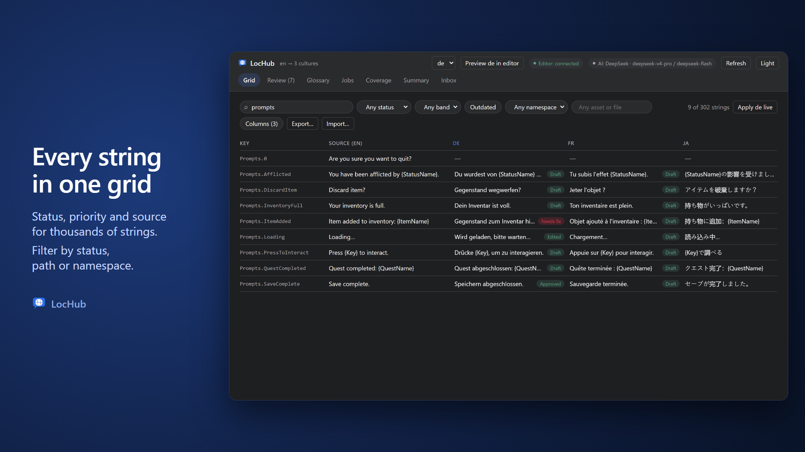

# Overview

LocHub is an AI-assisted localization tool for Unreal Engine. It plugs into your project's existing
localization target — the same manifest and archives the Unreal Localization Dashboard already gathers —
and adds an AI-assisted review workflow around them: a spreadsheet-like grid of every string and its
translations, a review queue for approving or fixing AI drafts, a glossary for consistent terminology, and
a translation job runner that calls an AI provider of your choice.

LocHub does not replace Unreal's localization system. It reads and writes the same `.manifest` and
`.archive` files your project already uses, and it registers itself as a Localization Service Provider so
the stock Localization Dashboard can talk to it too.

## How it fits together

LocHub has three parts, all installed together as one plugin:

| Part | What it is | Where it runs |
|------|-----------|---------------|
| Editor integration | Menu commands, Project Settings, the embedded LocHub tab | Inside Unreal Editor (C++) |
| Local service | Talks to your chosen AI provider, keeps the translation grid and review state | A small Node.js process on your machine (`127.0.0.1`, default port 47810) |
| Web app | The grid, review queue, glossary and job screens | Served by the local service, opened in an embedded browser tab inside the editor |

Nothing leaves your machine except calls to the AI provider's own API (see
[06_Settings_Reference.md](06_Settings_Reference.md) and [11_Troubleshooting_and_FAQ.md](11_Troubleshooting_and_FAQ.md)
for exactly what is sent and where).

> **Note:** The local service is a plain Node.js process LocHub starts and stops for you. You do not need
> to know Node.js to use LocHub — you only need it installed (see [02_Requirements.md](02_Requirements.md)).

## Main workflow

1. **Set Up Localization Target** — LocHub configures your project's `Game` localization target so it
   gathers text the way LocHub expects.
2. **Push** — send the gathered strings to the LocHub service.
3. **Run a translation job** — the AI provider translates and judges a batch of strings.
4. **Review** — a human reviewer approves, edits or rejects AI drafts in the Grid or the Review queue.
5. **Pull** — write the approved translations back into your project's archives and compile `.locres`.

[04_Quick_Start.md](04_Quick_Start.md) walks through this end to end.

## Where to go next

| If you want to... | Read |
|---|---|
| Check your engine version, OS and Node.js requirements | [02_Requirements.md](02_Requirements.md) |
| Install the plugin | [03_Installation.md](03_Installation.md) |
| Run your first translation job | [04_Quick_Start.md](04_Quick_Start.md) |
| Pick an AI provider and set up its API key | [05_AI_Providers_and_Keys.md](05_AI_Providers_and_Keys.md) |
| Understand every project setting | [06_Settings_Reference.md](06_Settings_Reference.md) |
| Use the Grid, Review queue, Glossary, Jobs, Inbox and Coverage screens | [07_Grid_and_Review.md](07_Grid_and_Review.md), [08_Glossary.md](08_Glossary.md), [09_Jobs_Inbox_Coverage.md](09_Jobs_Inbox_Coverage.md) |
| Run LocHub from a build/CI pipeline | [10_Commandlet_and_CI.md](10_Commandlet_and_CI.md) |
| Fix a problem | [11_Troubleshooting_and_FAQ.md](11_Troubleshooting_and_FAQ.md) |
| Find license and support information | [12_Support_and_License.md](12_Support_and_License.md) |

