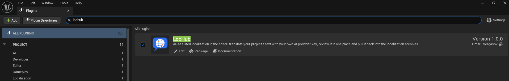

# Installation

## 1. Install from Fab

1. Buy or add LocHub from [Fab](https://www.fab.com/listings/aaf6a7ae-e02e-4975-91b4-129e2456e491), then install it into your **Engine** (not a specific project) from the Epic
   Games Launcher / Fab library, for the Unreal Engine version you use.
2. Open your project. LocHub ships with **Enable by Default off**, so open **Edit > Plugins**, find
   **LocHub** under the Localization category, and enable it.
3. Restart the editor when prompted.

> **Note:** LocHub from Fab comes prebuilt for Windows, macOS and Linux, so enabling it needs no compile
> step. Only Windows is tested by the author — see [02_Requirements.md](02_Requirements.md).

## 2. Installing from source

If you got LocHub as source (for example, copied into `Plugins/LocHub` of your project) instead of through
Fab, the steps are the same: enable it in **Edit > Plugins** and restart. The engine builds the plugin as
part of your project's normal build.

## 3. The Node.js check

LocHub checks whether a supported Node.js is available when you launch it: open the **LocHub** tab
(**Tools > LocHub > Open LocHub**), or run **Push**, **Push (Dry Run)**, **Pull** or **Restart Service**.
Nothing about Node.js happens when the editor itself starts. LocHub looks for it in this order, stopping at
the first one that works:

1. The per-user setting **Editor Preferences > Plugins > LocHub > Node.js Executable**, if you set one — when
   set, only that path is used.
2. `PATH`.
3. The usual per-OS install folders (macOS: `/opt/homebrew/bin`, `/usr/local/bin`, `/opt/local/bin`; Linux:
   `/usr/bin`, `/usr/local/bin`, `/snap/bin`; Windows: the `Program Files\nodejs` folder, and Volta).
4. Version managers (nvm, fnm, asdf, mise) — the newest suitable version any of them has installed.
5. On macOS/Linux only, as a last resort: your login shell's own environment.

If none of these finds Node.js 22.11 or newer, a **"LocHub: Node.js required"** window opens, listing where
it looked, with a **Download Node.js** link and an **Open Settings** button that takes you straight to the
**Node.js Executable** setting; the tab or the notification that triggered the check shows the error too.
The window opens once per failed launch attempt — it does not stack a second copy while one is already open.

> **Tip:** after installing Node.js, just launch LocHub again (for example press **Reload** in the tab). If
> it is still not found, restart the editor so it picks up the updated PATH.

## 4. What "installed" looks like

Once Node.js is found, LocHub is ready to use — you do not need to run any Node.js commands yourself. The
plugin adds:

- A **Tools > LocHub** menu (Push, Push (Dry Run), Pull, Open LocHub, Restart Service, Set Up Localization
  Target).
- A **Plugins > LocHub** page in **Project Settings** (see [06_Settings_Reference.md](06_Settings_Reference.md)).
- An embedded **LocHub** editor tab (opened through **Tools > LocHub > Open LocHub**) that shows the LocHub
  web app: Grid, Review, Glossary, Jobs, Coverage, Summary and Inbox.

Continue with [04_Quick_Start.md](04_Quick_Start.md) to run your first Push and translation job.
