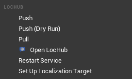
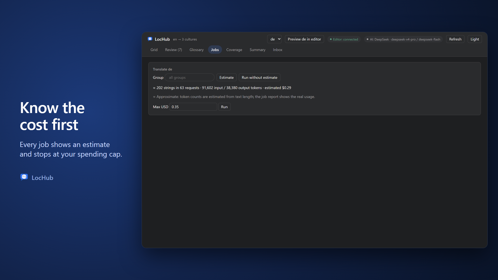
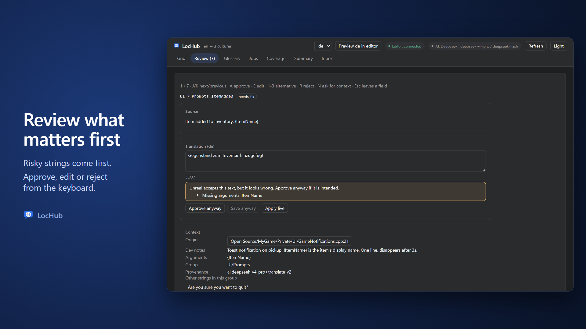

# Quick Start

This walks through one full cycle: preparing your localization target, sending strings to LocHub, running
an AI translation job, reviewing the result, and writing it back into your project. It assumes LocHub is
already installed (see [03_Installation.md](03_Installation.md)) and you have picked an AI provider and set
its API key, or, for Anthropic, signed in to Claude Code instead (see
[05_AI_Providers_and_Keys.md](05_AI_Providers_and_Keys.md)).

The example project below is called `MyGame`; substitute your own project's name.

## 1. Choose your cultures (optional)

The target's **native culture** is the language your source text is written in, and the one LocHub translates
from. Set Up gives a new target the native culture in **Project Settings > Plugins > LocHub > Localization Target >
Setup Native Culture** (`en` by default — set it to, for example, `zh-Hans` for a game written in Chinese, and list
`en` among the foreign cultures). A target that already has a native culture keeps it; change it in the
Localization Dashboard.

LocHub sets up a `Game` localization target with a default set of foreign cultures (**de, fr, es, ja**). If
you want different languages, set them first in **Project Settings > Plugins > LocHub**, under
**Localization Target > Setup Foreign Cultures**, before the next step. Every run of Set Up adds whichever
listed cultures the target does not already have, and never removes one — so if you remove a culture in the
Localization Dashboard but leave it listed here, the next Set Up brings it back. To drop a culture for good,
remove it from Setup Foreign Cultures too. Unknown culture names are skipped and listed in the Set Up
summary.

## 2. Set Up Localization Target

Go to **Tools > LocHub > Set Up Localization Target**.

This creates the `Game` localization target if it does not exist yet, or completes an existing one: it adds
the foreign cultures from the previous step, points the target's text and asset gathering at your project's
`Source` and `Content` folders (and those of your enabled plugins), turns on format-pattern and rich-text
validation, and makes LocHub the active Localization Service Provider. It only adds what is missing — running
it again on an already-configured target is a no-op.

## 3. Gather text

Use Unreal's own **Window > Localization Dashboard**, or your project's usual Gather Text step, to gather
the `Game` target's manifest. LocHub Push always sends what the manifest already has — it does not gather
text itself.

> **Note:** if the last Gather Text you ran only covered part of the project, Push warns you before
> retiring any strings that the manifest no longer has, so a partial gather cannot silently delete strings
> from LocHub.

## 4. Push

Go to **Tools > LocHub > Push (Dry Run)** first to see what would be added, changed or retired without
changing anything. When it looks right, run **Tools > LocHub > Push** to actually send the gathered strings
to the LocHub service.

## 5. Run a translation job

Open **Tools > LocHub > Open LocHub** — this opens the LocHub tab inside the editor. Switch to the **Jobs**
tab, pick the culture you want to translate, and optionally narrow the scope to one group or a folder.

1. Click **Estimate** to see how many strings and requests the job would use, and (for a paid provider) the
   estimated cost.
2. Enter a **Max USD** budget if one is shown, then click **Run**.
3. The job runs in the background — translating, then a deterministic consistency check, then a second
   AI pass that judges each translation — and the tab shows live progress.

> **Tip:** a job never overwrites a cell a human already touched — it turns its result into a suggestion
> instead, so you never lose review work to a job that runs concurrently.

> **Tip:** to skip estimating altogether, click **Run without estimate** next to Estimate — the job starts
> right away with no Max USD limit, and its report shows the real cost.

## 6. Review

Switch to the **Review** tab (it shows a count when strings are waiting). Open a string and:

- **Approve** to accept the AI draft as shown.
- Edit the text and **Save** to accept your own edit instead.
- **Reject** with a short reason to send it back for another translation pass.

Details on the Grid, Review queue and their statuses are in [07_Grid_and_Review.md](07_Grid_and_Review.md).

## 7. Pull

Back in the editor, run **Tools > LocHub > Pull**. This writes the released translations into your
project's localization archives, compiles `.locres`, and applies any answered translator questions (as
developer notes on the source text, on UE 5.8+; on 5.6/5.7 the answer stays in LocHub and still reaches the
translator through the app).

That's one full cycle. Repeat from step 3 (or step 4 if nothing new needs gathering) whenever your project's
text changes.
