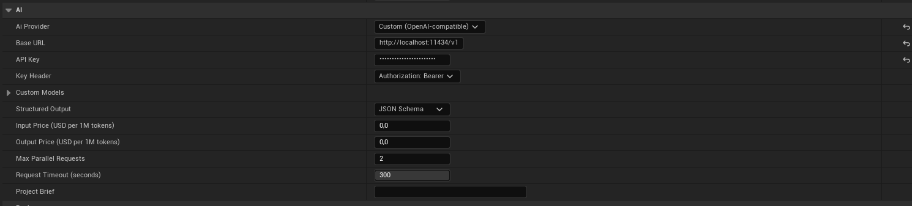
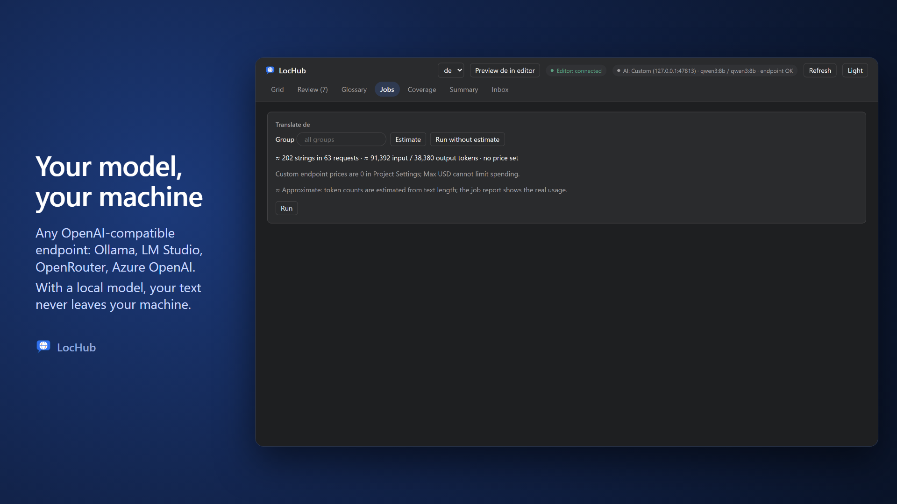

# AI Providers and API Keys

LocHub does not translate anything by itself. Every translation job sends strings to an AI provider you
choose, using a translate model and a cheaper judge model that checks the translation afterwards. You pick
the provider and both models in **Project Settings > Plugins > LocHub**, under the **AI** category (see
[06_Settings_Reference.md](06_Settings_Reference.md) for every field).

## Supported providers

| Provider | Setting value | Default translate model | Default judge model |
|---|---|---|---|
| Anthropic (Claude) | Anthropic | `claude-opus-5-5` | `claude-sonnet-5` |
| OpenAI | OpenAI | `gpt-6-sol` | `gpt-6-luna` |
| xAI | xAI (Grok) | `grok-4.7` | `grok-4.7` |
| DeepSeek | DeepSeek | `deepseek-v4-pro` | `deepseek-flash` |
| Google Gemini | Google Gemini | `gemini-3.8-flash` | `gemini-3.5-flash-lite` |
| Any OpenAI-compatible endpoint (Ollama, LM Studio, OpenRouter, Azure OpenAI, …) | Custom (OpenAI-compatible) | none — you set it | none — empty uses the translate model |

You can change either model to any model ID your provider's API accepts — the defaults above are just a
sensible starting point (a cheaper model, or an older/newer generation).

## Setting an API key

Each provider has its own **API Key** field in **Project Settings > Plugins > LocHub > AI**, directly under
**AI Provider** (and, for Anthropic specifically, under **Anthropic Auth**) — switching **AI Provider** shows
that provider's own key field and hides the others. Paste the key in; it is masked while typing. For **Custom
(OpenAI-compatible)** the key is optional — see the next section.

The key is saved in `Config/DefaultEditor.ini` along with the other LocHub settings, so it travels with the
project like any other project setting, including through whatever version control the project uses: anyone
who can read the project's config can read the key.

Changing the key applies to the running LocHub service the same way changing the provider or a model does:
right away, or, while a translation job is running, right after that job finishes.

## Custom (OpenAI-compatible) endpoint

**Custom (OpenAI-compatible)** points LocHub at any server that speaks the OpenAI Chat Completions API: a model
running on your own machine (Ollama, LM Studio, llama.cpp server, vLLM), a router such as OpenRouter, or a private
deployment such as Azure OpenAI. With a local model your text never leaves your machine, and translating costs
nothing per token.

Set **AI Provider** to **Custom (OpenAI-compatible)**, then fill in:

- **Base URL** — the address of the API, without `/chat/completions` (for example `http://localhost:11434/v1`).
  It must start with `http://` or `https://`; LocHub adds `/chat/completions` and `/models` itself. Logs and error
  messages only ever show its scheme, host and port.
- **API Key** — optional. Leave it empty for a local server: no authorization header is sent then.
- **Key Header** — **Authorization: Bearer** for almost every server; **api-key** for Azure OpenAI.
- **Custom Models** — the model IDs exactly as the server lists them. **Translate Model** is required; leave
  **Judge Model** empty to judge with the same model.
- **Structured Output** — how LocHub asks for JSON. Start with **JSON Schema**; if the server rejects it or the
  answers come back broken, switch to **JSON Object**, and if that fails too, to **Prompt Only**.
- **Input Price** and **Output Price** — USD per 1M tokens, used for both models (see "Cost and Max USD" below).
- **Max Parallel Requests** — how many requests LocHub sends to the endpoint at once, across every running job
  (default 2). Keep it low for a single GPU.
- **Request Timeout (seconds)** — how long one attempt may take before LocHub gives up on it: 30 to 300, default
  300 (Node.js, which runs the LocHub service, never waits longer than 300 seconds for an answer to start). A request
  that times out is not retried as is: LocHub splits its group in two and sends the smaller halves instead, so a slow
  model still finishes — each request just covers fewer strings. If the endpoint has not answered a single request
  yet, LocHub probes it with one split group at a time instead of sending the whole job, and stops the job with "the
  request timed out after …" if even one string cannot finish in time.
  LocHub never sends an output-length cap to a Custom endpoint — the server's own default applies (see the Ollama
  recipe below for the one server where that default is usually too small).

Every Custom setting applies to the running LocHub service the same way a provider or model change does: right
away, or, while a translation job is running, right after that job finishes.

### Recipes

| Server | Base URL | API Key | Key Header | Models |
|---|---|---|---|---|
| Ollama | `http://localhost:11434/v1` | empty | Authorization: Bearer | a model you pulled, as `ollama list` shows it (for example `qwen3:8b`) |
| LM Studio | `http://localhost:1234/v1` | empty | Authorization: Bearer | the ID LM Studio shows for the loaded model |
| OpenRouter | `https://openrouter.ai/api/v1` | your OpenRouter key | Authorization: Bearer | an OpenRouter model ID (`vendor/model`) |
| Azure OpenAI | `https://<resource>.openai.azure.com/openai/v1` | your Azure OpenAI key | api-key | your deployment name |

For every recipe, start with **Structured Output** = JSON Schema and fall back to JSON Object, then Prompt Only, if
the answers break. Azure OpenAI may not list deployment names in its model list, so the status pill can say **model
missing** even though jobs work — if a small job translates, ignore it.

**Ollama's context window.** Ollama's default context window (`num_ctx`, 4096 tokens on current builds) is smaller
than a full translate request (40 strings plus the system prompt, glossary and brief), and Ollama silently
truncates whatever does not fit instead of returning an error — this is the most common reason a Custom endpoint
job on Ollama comes back with garbled or incomplete translations. Raise it before running a job: either start
`ollama serve` with `OLLAMA_CONTEXT_LENGTH` set to a larger value (for example `OLLAMA_CONTEXT_LENGTH=16384`), or
set `num_ctx` for the model itself with a `Modelfile` (`PARAMETER num_ctx 16384`). LM Studio and llama.cpp server
expose the same setting under their own launch options.

### Cost and Max USD

LocHub prices both models of a Custom endpoint with **Input Price** and **Output Price**. With both at `0` (right for
a free local model), the Jobs tab's estimate shows no dollar amount, says "no price set" and adds "Custom endpoint
prices are 0 in Project Settings; Max USD cannot limit spending." — there is no Max USD field, and nothing caps what
the job costs. Set the prices your endpoint charges (a paid router or cloud deployment) and the estimate and the
**Max USD** cap work exactly as for the built-in providers. Token counts for a Custom endpoint are always a local
approximation (**≈ Approximate**).

### The AI status pill

The AI pill at the top of LocHub shows the endpoint's host and what LocHub found when the service started and asked
the endpoint for its model list:

| The pill says | Meaning |
|---|---|
| checking endpoint… | The check is still running. |
| endpoint OK | The endpoint answered and lists every configured model. |
| model missing | The endpoint answered but does not list a configured model; hover the pill to see which. |
| unreachable | LocHub could not reach the endpoint, or the endpoint refused the key. Shown in red; hover for the reason. |
| no model list | The endpoint has no model list LocHub can read. Jobs may still work — run a small one to find out. |

## Claude Subscription (an alternative to an API key, Anthropic only)

When **AI Provider** is Anthropic, **Anthropic Auth** offers a second way to authenticate: **Claude
Subscription**. Instead of an API key, LocHub runs your own, already signed-in **Claude Code** CLI (`claude`)
on your machine — hidden, with no tools enabled, once per translation or judge request — and reads back its
structured result. Selecting it hides the **API Key** field entirely: no key is read or sent to the service
in this mode.

**Setting it up:**

1. Install [Claude Code](https://claude.com/product/claude-code) and make sure `claude` is reachable on
   `PATH`.
2. Run `claude` once from a terminal and sign in to your Claude subscription.
3. In **Project Settings > Plugins > LocHub > AI**, set **AI Provider** to Anthropic and **Anthropic Auth**
   to **Claude Subscription**.

LocHub checks whether Claude Code is installed and signed in, and the Jobs tab's **Estimate** and **Run**
buttons stay disabled — with the reason in a tooltip — until it is. See
[11_Troubleshooting_and_FAQ.md](11_Troubleshooting_and_FAQ.md) if either check fails.

**Limits:**

- The Jobs tab's estimate still shows string, request and token counts, but no dollar figure and no **Max
  USD** field: usage is not billed per token here, it counts against your Claude plan's own usage limits
  instead.
- Each translation or judge request is a separate, one-shot `claude` process with no persisted session, and
  is treated as a (retryable) error if it runs longer than 10 minutes.

**When to prefer the API key instead:** pick **API Key** when you want a per-job USD budget you can cap in
advance, or you would rather bill translation to a metered API key than against your personal Claude
subscription's usage limits. Pick **Claude Subscription** when you already pay for Claude Code and would
rather not manage a separate Anthropic API key.

## Estimating cost before you run a job

Before running a job, click **Estimate** in the Jobs tab. LocHub shows:

- How many strings and model requests the job would use.
- Approximate input/output token counts.
- An estimated cost in USD, when the selected models have a known price (for a Custom endpoint: when its Input or
  Output Price is set) and the job is billed per token —
  you can then set a **Max USD** budget the job will not exceed. Under Claude Subscription auth there is no
  dollar figure or Max USD field: usage counts against your Claude plan's own limits instead (see the
  Claude Subscription section above).

If every string in scope already has a usable translation-memory match or a cached answer, the estimate
says so and the job can run with **no cost and no Max USD** — reuse never calls the model, though the judge
pass may still run over the reused text.

For Anthropic with an API key, Estimate counts tokens with Anthropic for every string in scope: LocHub
counts several groups at once instead of one at a time, and remembers groups it has already counted while
the service keeps running, so re-estimating the same scope — or clicking **Run** right after **Estimate** —
does not count them again. If Anthropic rate-limits or is overloaded while counting, LocHub falls back to a
local, approximate count for the affected part. Every other provider, and Claude Subscription auth, always
uses the local count. Either way, the estimate is then marked **≈ Approximate**.

If you would rather skip estimating altogether, click **Run without estimate** next to **Estimate**: the job
starts immediately with no Max USD limit, and its finished report shows the real cost.

> **Tip:** the estimate is an upper bound before the fact; the finished job's own report always shows the
> real token usage. If you don't need the estimate at all, **Run without estimate** skips straight to
> running the job.

## When something goes wrong

- If every request of a job's first round fails the same way (a bad model ID, an invalid key, no credit
  left), the job stops immediately as **failed** and changes no cell — nothing partial gets written.
- A job that fails for other strings during the run shows up to three distinct **Error reasons**, with any
  key-shaped text redacted, so you know what to fix without needing the raw log.
- If you change AI settings (provider, auth, API key, models, any Custom endpoint setting) while a job is running,
  the change applies as soon as that job finishes — the editor shows a notification confirming this.

See [11_Troubleshooting_and_FAQ.md](11_Troubleshooting_and_FAQ.md) for provider-specific problems, and
[06_Settings_Reference.md](06_Settings_Reference.md) for the exact settings referenced above.
