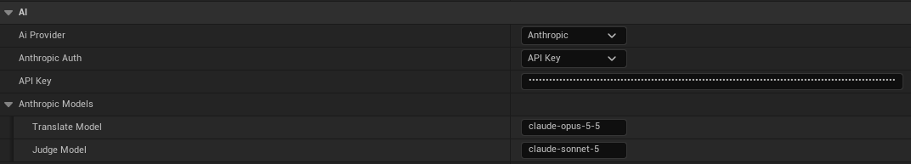

# AI Providers and API Keys

LocHub does not translate anything by itself. Every translation job sends strings to an AI provider you
choose, using a translate model and a cheaper judge model that checks the translation afterwards. You pick
the provider and both models in **Project Settings > Plugins > LocHub**, under the **AI** category (see
[06_Settings_Reference.md](06_Settings_Reference.md) for every field).

## Supported providers

| Provider | Setting value | Default translate model | Default judge model |
|---|---|---|---|
| Anthropic (Claude) | Anthropic | `claude-opus-5-5` | `claude-sonnet-5` |
| OpenAI | OpenAI | `gpt-6-sol` | `gpt-6-luna` |
| xAI | xAI (Grok) | `grok-4.7` | `grok-4.7` |
| DeepSeek | DeepSeek | `deepseek-v4-pro` | `deepseek-flash` |
| Google Gemini | Google Gemini | `gemini-3.8-flash` | `gemini-3.5-flash-lite` |

You can change either model to any model ID your provider's API accepts — the defaults above are just a
sensible starting point (a cheaper model, or an older/newer generation).

## Setting an API key

Each provider has its own **API Key** field in **Project Settings > Plugins > LocHub > AI**, directly under
**AI Provider** (and, for Anthropic specifically, under **Anthropic Auth**) — switching **AI Provider** shows
that provider's own key field and hides the others. Paste the key in; it is masked while typing.

The key is saved in `Config/DefaultEditor.ini` along with the other LocHub settings, so it travels with the
project like any other project setting, including through whatever version control the project uses: anyone
who can read the project's config can read the key.

Changing the key applies to the running LocHub service the same way changing the provider or a model does:
right away, or, while a translation job is running, right after that job finishes.

## Claude Subscription (an alternative to an API key, Anthropic only)

When **AI Provider** is Anthropic, **Anthropic Auth** offers a second way to authenticate: **Claude
Subscription**. Instead of an API key, LocHub runs your own, already signed-in **Claude Code** CLI (`claude`)
on your machine — hidden, with no tools enabled, once per translation or judge request — and reads back its
structured result. Selecting it hides the **API Key** field entirely: no key is read or sent to the service
in this mode.

**Setting it up:**

1. Install [Claude Code](https://claude.com/product/claude-code) and make sure `claude` is reachable on
   `PATH`.
2. Run `claude` once from a terminal and sign in to your Claude subscription.
3. In **Project Settings > Plugins > LocHub > AI**, set **AI Provider** to Anthropic and **Anthropic Auth**
   to **Claude Subscription**.

LocHub checks whether Claude Code is installed and signed in, and the Jobs tab's **Estimate** and **Run**
buttons stay disabled — with the reason in a tooltip — until it is. See
[11_Troubleshooting_and_FAQ.md](11_Troubleshooting_and_FAQ.md) if either check fails.

**Limits:**

- The Jobs tab's estimate still shows string, request and token counts, but no dollar figure and no **Max
  USD** field: usage is not billed per token here, it counts against your Claude plan's own usage limits
  instead.
- Each translation or judge request is a separate, one-shot `claude` process with no persisted session, and
  is treated as a (retryable) error if it runs longer than 10 minutes.

**When to prefer the API key instead:** pick **API Key** when you want a per-job USD budget you can cap in
advance, or you would rather bill translation to a metered API key than against your personal Claude
subscription's usage limits. Pick **Claude Subscription** when you already pay for Claude Code and would
rather not manage a separate Anthropic API key.

## Estimating cost before you run a job

Before running a job, click **Estimate** in the Jobs tab. LocHub shows:

- How many strings and model requests the job would use.
- Approximate input/output token counts.
- An estimated cost in USD, when the selected models have a known price and the job is billed per token —
  you can then set a **Max USD** budget the job will not exceed. Under Claude Subscription auth there is no
  dollar figure or Max USD field: usage counts against your Claude plan's own limits instead (see the
  Claude Subscription section above).

If every string in scope already has a usable translation-memory match or a cached answer, the estimate
says so and the job can run with **no cost and no Max USD** — reuse never calls the model, though the judge
pass may still run over the reused text.

For Anthropic with an API key, Estimate counts tokens with Anthropic for every string in scope: LocHub
counts several groups at once instead of one at a time, and remembers groups it has already counted while
the service keeps running, so re-estimating the same scope — or clicking **Run** right after **Estimate** —
does not count them again. If Anthropic rate-limits or is overloaded while counting, LocHub falls back to a
local, approximate count for the affected part. Every other provider, and Claude Subscription auth, always
uses the local count. Either way, the estimate is then marked **≈ Approximate**.

If you would rather skip estimating altogether, click **Run without estimate** next to **Estimate**: the job
starts immediately with no Max USD limit, and its finished report shows the real cost.

> **Tip:** the estimate is an upper bound before the fact; the finished job's own report always shows the
> real token usage. If you don't need the estimate at all, **Run without estimate** skips straight to
> running the job.

## When something goes wrong

- If every request of a job's first round fails the same way (a bad model ID, an invalid key, no credit
  left), the job stops immediately as **failed** and changes no cell — nothing partial gets written.
- A job that fails for other strings during the run shows up to three distinct **Error reasons**, with any
  key-shaped text redacted, so you know what to fix without needing the raw log.
- If you change AI settings (provider, auth, API key, models) while a job is running, the change applies as
  soon as that job finishes — the editor shows a notification confirming this.

See [11_Troubleshooting_and_FAQ.md](11_Troubleshooting_and_FAQ.md) for provider-specific problems, and
[06_Settings_Reference.md](06_Settings_Reference.md) for the exact settings referenced above.
