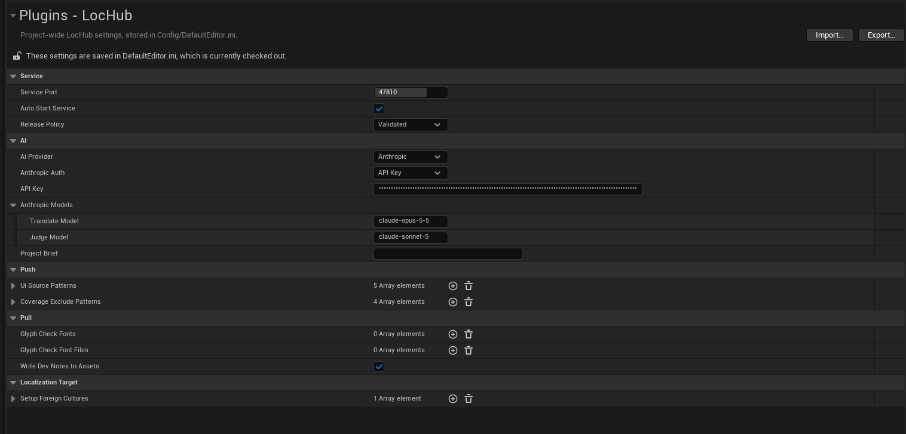

# Settings Reference

Every LocHub project setting lives in **Project Settings > Plugins > LocHub**, grouped into the categories
below. These settings are saved to your project's `Config/DefaultEditor.ini` and apply to everyone who opens
the project (unlike the per-user **Node.js Executable** setting at the end of this page).

## Service

| Setting | Type | Default | What it does |
|---|---|---|---|
| **Service Port** | Integer (1024–65535) | `47810` | The local port the LocHub service listens on. |
| **Auto Start Service** | Bool | On | Starts the service (`node <plugin>/Resources/LocHubService/lochub_service.mjs serve`) automatically whenever Push, Pull or Open LocHub finds nothing answering on the port. |
| **Release Policy** | Validated / Approved Only | Validated | Sent to the service when it starts, and controls which strings a **Pull** may write into your archives. A running service keeps whatever policy it started with until you use **Tools > LocHub > Restart Service**. |

- **Validated** releases AI drafts that passed the automatic checks, plus anything a human approved or
  edited.
- **Approved Only** releases only strings a human explicitly approved or edited.

## AI

| Setting | Type | Default | What it does |
|---|---|---|---|
| **AI Provider** | Anthropic / OpenAI / xAI (Grok) / DeepSeek / Google Gemini | Anthropic | Which provider translation and judging jobs use. Applied to the running service immediately, or — while a job is in progress — right after that job finishes. |
| **Project Brief** | Multi-line text | Empty | What the game is, its setting and tone, who the player is, and anything else a translator should know before touching a single string. Shared by every culture, sent with every translation and review request. Applied to the running service the same way as AI Provider: immediately, or right after a running job finishes. |
| **Anthropic Auth** | API Key / Claude Subscription | API Key | How LocHub authenticates with Anthropic when Anthropic is selected. **API Key**: enter it in the **API Key** field directly below. **Claude Subscription**: runs your own signed-in Claude Code CLI (`claude`) instead — hides the **API Key** field entirely, since no key is read or sent. Only shown when AI Provider is Anthropic. See [05_AI_Providers_and_Keys.md](05_AI_Providers_and_Keys.md) for setup and limits. |
| **API Key** | Password-masked text | Empty | The selected provider's key — shown directly under **AI Provider** (and, for Anthropic, under **Anthropic Auth**, only when Anthropic Auth is API Key). One key per provider; switching **AI Provider** shows that provider's own key field and hides the others. Masked while typing. Saved in `Config/DefaultEditor.ini` with the other LocHub settings, so it travels with the project like any other project setting. Applied to the running service the same way as AI Provider: immediately, or right after a running job finishes. |
| **Anthropic Models** | Translate Model / Judge Model | `claude-opus-5-5` / `claude-sonnet-5` | The Claude model IDs used to translate and to judge. Only shown when AI Provider is Anthropic. |
| **OpenAI Models** | Translate Model / Judge Model | `gpt-6-sol` / `gpt-6-luna` | The OpenAI model IDs used to translate and to judge. Only shown when AI Provider is OpenAI. |
| **xAI Models** | Translate Model / Judge Model | `grok-4.7` / `grok-4.7` | The xAI model IDs used to translate and to judge. Only shown when AI Provider is xAI. |
| **DeepSeek Models** | Translate Model / Judge Model | `deepseek-v4-pro` / `deepseek-flash` | The DeepSeek model IDs used to translate and to judge. Only shown when AI Provider is DeepSeek. |
| **Gemini Models** | Translate Model / Judge Model | `gemini-3.8-flash` / `gemini-3.5-flash-lite` | The Google Gemini model IDs used to translate and to judge. Only shown when AI Provider is Gemini. |

Each *Models* setting is a pair of free-text model ID fields (**Translate Model**, **Judge Model**) — you
can point either one at any model ID your provider's API accepts, not just the defaults above. See
[05_AI_Providers_and_Keys.md](05_AI_Providers_and_Keys.md) for the full picture (cost estimates,
key setup).

## Push

| Setting | Type | Default | What it does |
|---|---|---|---|
| **Ui Source Patterns** | Array of wildcard paths | `*/UI/*`, `*/Hud/*`, `*/Widgets/*`, `*/Menus/*`, `*/WBP_*` | A string whose manifest source location matches any of these wildcards is sent to LocHub as widget text. |
| **Coverage Exclude Patterns** | Array of wildcard paths | `Source/*Editor/*`, `*/Tests/*`, `*/ThirdParty/*`, `*.generated.h` | Paths, relative to the project folder, that the Coverage report skips. |

## Pull

| Setting | Type | Default | What it does |
|---|---|---|---|
| **Glyph Check Fonts** | Array of Font asset references | Empty | Every listed font must have a glyph for every character of a translation, or Pull rejects it. An empty list turns the glyph check off. |
| **Glyph Check Font Files** | Array of font files (`.ttf`, `.otf`) | Empty | Font files outside the asset system (for example RmlUi fonts) checked the same way as Glyph Check Fonts. |
| **Write Dev Notes To Assets** | Bool | On | Writes an answered translator question into the DevNotes of the source text asset. When off, every answer instead goes to `Saved/LocHub/DevNotesProposals.md`. Requires **UE 5.8 or later** — on 5.6 and 5.7 answers stay in LocHub and still reach the translator, they are just not written onto the asset. |

## Localization Target

| Setting | Type | Default | What it does |
|---|---|---|---|
| **Setup Foreign Cultures** | Array of culture codes | `de`, `fr`, `es`, `ja` | The foreign cultures **Tools > LocHub > Set Up Localization Target** adds to the `Game` target. Every run adds whichever listed cultures the target does not already have (a union; existing cultures are never removed) — so a culture you removed in the Localization Dashboard comes back on the next Set Up if it is still listed here. To drop a culture for good, remove it from this setting too. Unknown culture names (not one the engine recognizes) are skipped and named in the Set Up summary. |

## Node.js Executable (per-user, Editor Preferences)

| Setting | Type | Default | What it does |
|---|---|---|---|
| **Node.js Executable** | File path | Empty (auto-detect) | Found under **Editor Preferences > Plugins > LocHub**, not Project Settings — it is per-user, not saved into the project. When set, LocHub uses exactly this Node.js executable and skips every other lookup. When empty, LocHub searches `PATH`, the usual per-OS install folders, version managers, and — on macOS/Linux — your login shell, in that order (see [03_Installation.md](03_Installation.md)). |

> **Tip:** the **Node.js required** window that appears when no supported Node.js is found has an **Open
> Settings** button that jumps straight to this setting.
