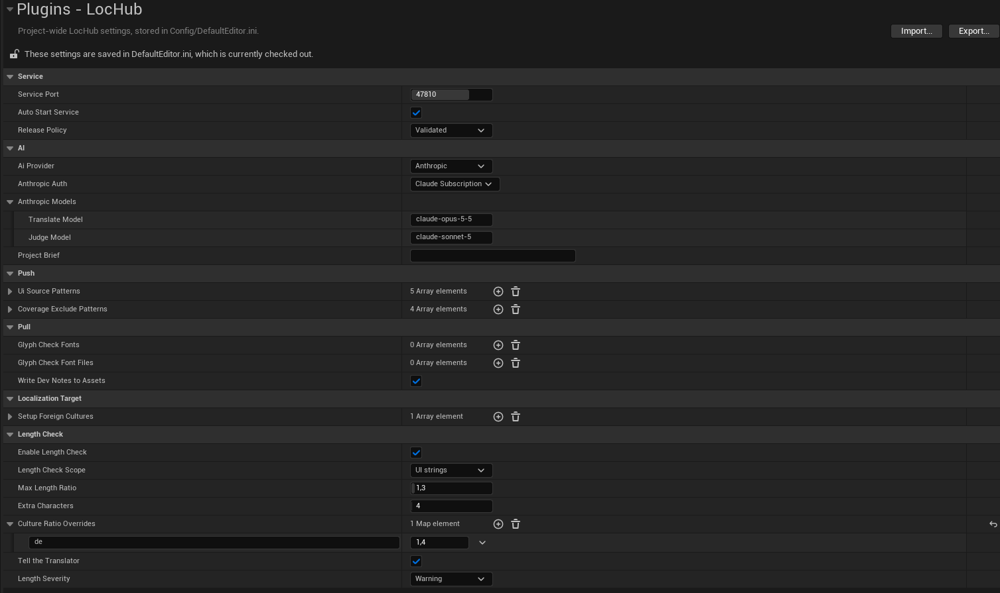
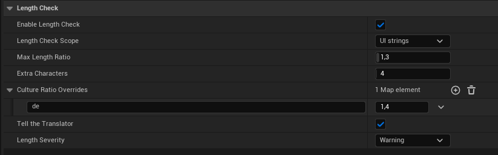

# Settings Reference

Every LocHub project setting lives in **Project Settings > Plugins > LocHub**, grouped into the categories
below. These settings are saved to your project's `Config/DefaultEditor.ini` and apply to everyone who opens
the project (unlike the per-user **Node.js Executable** setting at the end of this page).

## Service

| Setting | Type | Default | What it does |
|---|---|---|---|
| **Service Port** | Integer (1024–65535) | `47810` | The local port the LocHub service listens on. |
| **Auto Start Service** | Bool | On | Starts the service (`node <plugin>/Resources/LocHubService/lochub_service.mjs serve`) automatically whenever Push, Pull or Open LocHub finds nothing answering on the port. |
| **Release Policy** | Validated / Approved Only | Validated | Sent to the service when it starts, and controls which strings a **Pull** may write into your archives. A running service keeps whatever policy it started with until you use **Tools > LocHub > Restart Service**. |

- **Validated** releases AI drafts that passed the automatic checks, plus anything a human approved or
  edited.
- **Approved Only** releases only strings a human explicitly approved or edited.

## AI

| Setting | Type | Default | What it does |
|---|---|---|---|
| **AI Provider** | Anthropic / OpenAI / xAI (Grok) / DeepSeek / Google Gemini / Custom (OpenAI-compatible) | Anthropic | Which provider translation and judging jobs use. Applied to the running service immediately, or — while a job is in progress — right after that job finishes. |
| **Project Brief** | Multi-line text | Empty | What the game is, its setting and tone, who the player is, and anything else a translator should know before touching a single string. Shared by every culture, sent with every translation and review request. Applied to the running service the same way as AI Provider: immediately, or right after a running job finishes. |
| **Anthropic Auth** | API Key / Claude Subscription | API Key | How LocHub authenticates with Anthropic when Anthropic is selected. **API Key**: enter it in the **API Key** field directly below. **Claude Subscription**: runs your own signed-in Claude Code CLI (`claude`) instead — hides the **API Key** field entirely, since no key is read or sent. Only shown when AI Provider is Anthropic. See [05_AI_Providers_and_Keys.md](05_AI_Providers_and_Keys.md) for setup and limits. |
| **API Key** | Password-masked text | Empty | The selected provider's key — shown directly under **AI Provider** (and, for Anthropic, under **Anthropic Auth**, only when Anthropic Auth is API Key). One key per provider; switching **AI Provider** shows that provider's own key field and hides the others. Masked while typing; optional for Custom (OpenAI-compatible), where an empty key sends no key at all. Saved in `Config/DefaultEditor.ini` with the other LocHub settings, so it travels with the project like any other project setting. Applied to the running service the same way as AI Provider: immediately, or right after a running job finishes. |
| **Anthropic Models** | Translate Model / Judge Model | `claude-opus-5-5` / `claude-sonnet-5` | The Claude model IDs used to translate and to judge. Only shown when AI Provider is Anthropic. |
| **OpenAI Models** | Translate Model / Judge Model | `gpt-6-sol` / `gpt-6-luna` | The OpenAI model IDs used to translate and to judge. Only shown when AI Provider is OpenAI. |
| **xAI Models** | Translate Model / Judge Model | `grok-4.7` / `grok-4.7` | The xAI model IDs used to translate and to judge. Only shown when AI Provider is xAI. |
| **DeepSeek Models** | Translate Model / Judge Model | `deepseek-v4-pro` / `deepseek-flash` | The DeepSeek model IDs used to translate and to judge. Only shown when AI Provider is DeepSeek. |
| **Gemini Models** | Translate Model / Judge Model | `gemini-3.8-flash` / `gemini-3.5-flash-lite` | The Google Gemini model IDs used to translate and to judge. Only shown when AI Provider is Gemini. |
| **Base URL** | Text | Empty | Custom only. The OpenAI-compatible API address, for example `http://localhost:11434/v1`; must start with `http://` or `https://`. LocHub adds `/chat/completions` and `/models`. Logs show only its scheme, host and port. LocHub never sends an output-length cap to this endpoint — the server's own default applies. Sent to the service in an environment variable, never on its command line. A redirect from this address is refused, not followed. |
| **Key Header** | Authorization: Bearer / api-key | Authorization: Bearer | Custom only. How the API key is sent; **api-key** is for Azure OpenAI. |
| **Custom Models** | Translate Model / Judge Model | Empty / Empty | Custom only. Model IDs exactly as the endpoint lists them. Translate Model is required — without it LocHub does not start the service; an empty Judge Model uses the Translate Model. |
| **Structured Output** | JSON Schema / JSON Object / Prompt Only | JSON Schema | Custom only. How LocHub asks for JSON: try JSON Schema first, then JSON Object, then Prompt Only. |
| **Input Price (USD per 1M tokens)** | Number (0 or more) | `0` | Custom only. Price of input tokens, for both models. |
| **Output Price (USD per 1M tokens)** | Number (0 or more) | `0` | Custom only. Price of output tokens, for both models. With both prices at 0 the estimate shows no cost and Max USD cannot limit spending. |
| **Max Parallel Requests** | Integer (1–32) | `2` | Custom only. The most requests LocHub sends to the endpoint at once, across every running job (not just one job's own requests). Every value in this range takes effect. |
| **Request Timeout (seconds)** | Integer (30–300) | `300` | Custom only. How long one attempt may take before LocHub gives up on it; 300 is the most Node.js ever waits for an answer to start. A timed-out request is not retried as is — LocHub splits its group into smaller pieces instead, which is how a slow model still finishes. |

Each *Models* setting is a pair of free-text model ID fields (**Translate Model**, **Judge Model**) — you
can point either one at any model ID your provider's API accepts, not just the defaults above. See
[05_AI_Providers_and_Keys.md](05_AI_Providers_and_Keys.md) for the full picture (cost estimates,
key setup, Custom endpoint recipes). Every Custom setting is applied to the running service the same way as AI
Provider: immediately, or right after a running job finishes.

## Push

| Setting | Type | Default | What it does |
|---|---|---|---|
| **Ui Source Patterns** | Array of wildcard paths | `*/UI/*`, `*/Hud/*`, `*/Widgets/*`, `*/Menus/*`, `*/WBP_*` | A string whose manifest source location matches any of these wildcards is sent to LocHub as widget text. |
| **Coverage Exclude Patterns** | Array of wildcard paths | `Source/*Editor/*`, `*/Tests/*`, `*/ThirdParty/*`, `*.generated.h` | Paths, relative to the project folder, that the Coverage report skips. |

## Pull

| Setting | Type | Default | What it does |
|---|---|---|---|
| **Glyph Check Fonts** | Array of Font asset references | Empty | Every listed font must have a glyph for every character of a translation, or Pull rejects it. An empty list turns the glyph check off. |
| **Glyph Check Font Files** | Array of font files (`.ttf`, `.otf`) | Empty | Font files outside the asset system (for example RmlUi fonts) checked the same way as Glyph Check Fonts. |
| **Write Dev Notes To Assets** | Bool | On | Writes an answered translator question into the DevNotes of the source text asset. When off, every answer instead goes to `Saved/LocHub/DevNotesProposals.md`. Requires **UE 5.8 or later** — on 5.6 and 5.7 answers stay in LocHub and still reach the translator, they are just not written onto the asset. |

## Localization Target

| Setting | Type | Default | What it does |
|---|---|---|---|
| **Setup Native Culture** | Culture code | `en` | The native culture **Tools > LocHub > Set Up Localization Target** gives the `Game` target when it has none yet — the language your source text is written in, which LocHub translates from (for example `zh-Hans` for a game written in Chinese). A target that already has a native culture keeps it, and the Set Up summary says so when it differs from this setting: change an existing target's native culture in the Localization Dashboard. A name the engine does not recognize falls back to `en`, and the Set Up summary says so. |
| **Setup Foreign Cultures** | Array of culture codes | `de`, `fr`, `es`, `ja` | The foreign cultures **Tools > LocHub > Set Up Localization Target** adds to the `Game` target. Every run adds whichever listed cultures the target does not already have (a union; existing cultures are never removed) — so a culture you removed in the Localization Dashboard comes back on the next Set Up if it is still listed here. To drop a culture for good, remove it from this setting too. Unknown culture names (not one the engine recognizes) are skipped and named in the Set Up summary. |

## Length Check

Flags translations that are likely too long for your UI — German or Russian text often runs 30–40% longer than
English, and English often runs far longer than Chinese — and tells the AI translator each string's limit up front, so it aims for a translation that fits.

| Setting | Type | Default | What it does |
|---|---|---|---|
| **Enable Length Check** | Bool | On | Turns the check on. The other Length Check settings are greyed out while it is off. |
| **Length Check Scope** | UI strings / All strings | UI strings | **UI strings** checks only strings sent as widget text — the ones matching **Ui Source Patterns** (see [Push](#push)). **All strings** checks every string. |
| **Max Length Ratio** | Float (1.0–5.0) | `1.3` | How many times as long as the source a translation may be. Two decimal places are used. For a Chinese, Japanese or Korean source translated into a Latin-script language, start around `1.8` (or set it per culture in **Culture Ratio Overrides**): CJK characters already count 2, but a translation still usually needs more room than that. |
| **Extra Characters** | Integer (0–100) | `4` | Characters allowed on top of the ratio, so a very short string ("OK", "Back") is not flagged for a few extra letters. |
| **Culture Ratio Overrides** | Map of culture → ratio | Empty | A different ratio for one culture (`pt-BR`) or a whole language (`de`, used for every German culture). An exact culture wins over its language; anything not listed uses **Max Length Ratio**. Ratios outside 1.0–5.0 are clamped; a key that is not a culture or language code is skipped and named in the Output Log. |
| **Tell the Translator** | Bool | On | Sends each string's limit with the translation request, so the AI aims for a translation that fits. |
| **Length Severity** | Warning / Must Confirm | Warning | **Warning**: a translation over its limit is flagged (band Y) and can be approved as usual. **Must Confirm**: approving or saving it needs **Approve anyway** / **Save anyway**, and an AI draft over the limit is written **Needs fix** — which the next job picks up and translates again. |

**How the limit is computed.** Limit = the source's visible length × the ratio for the culture, rounded up,
plus **Extra Characters**. Visible length counts what the player sees: format arguments such as `{0}` or
`{PlayerName}` and rich-text tags count 0; a `|plural(...)`, `|ordinal(...)`, `|gender(...)` or `|hpp(...)` argument
counts as its longest form; Chinese, Japanese and Korean characters, fullwidth forms, and emoji in the blocks
U+1F300–U+1F64F and U+1F900–U+1F9FF (most faces, gestures, animals, food and objects — each skin-tone modifier
counts 2 as well) count 2, while other symbols and emoji (for example the rocket, U+1F680, or the sun, U+2600)
count 1; an accent or
other mark that draws no glyph of its own, and a zero-width character, count 0 — a spacing mark (for example a
Devanagari vowel sign) draws its own glyph and counts like ordinary text; the four rich-text entities `&amp;` `&lt;`
`&gt;` `&quot;` count 1 each, the single character they stand for. A string whose source has nothing visible gets no
limit. Example: "Save & Quit" has 11 visible characters; with the defaults its limit is 11 × 1.3 = 14.3 → 15, plus
4 = **19**.

Length Check settings are applied to the running LocHub service the same way an **AI Provider** change is: right
away, or, while a translation job is running, right after that job finishes. Strings translated earlier keep their
review band until the next job or an edit checks them again; the cell panel always checks against the current
settings.

## Node.js Executable (per-user, Editor Preferences)

| Setting | Type | Default | What it does |
|---|---|---|---|
| **Node.js Executable** | File path | Empty (auto-detect) | Found under **Editor Preferences > Plugins > LocHub**, not Project Settings — it is per-user, not saved into the project. When set, LocHub uses exactly this Node.js executable and skips every other lookup. When empty, LocHub searches `PATH`, the usual per-OS install folders, version managers, and — on macOS/Linux — your login shell, in that order (see [03_Installation.md](03_Installation.md)). |

> **Tip:** the **Node.js required** window that appears when no supported Node.js is found has an **Open
> Settings** button that jumps straight to this setting.
