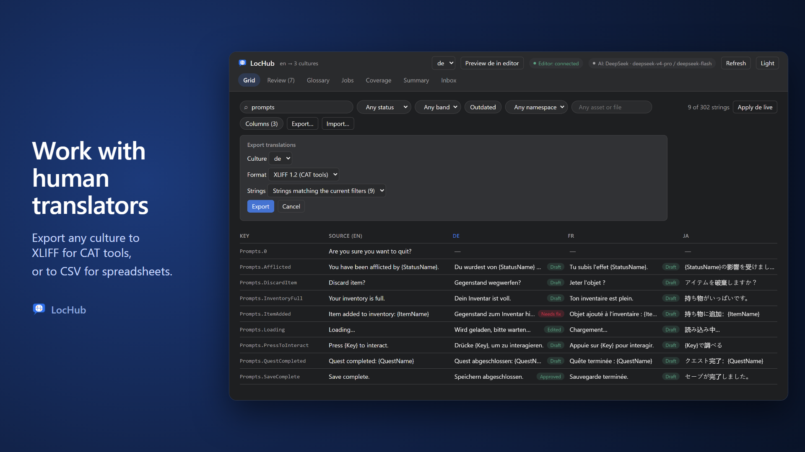
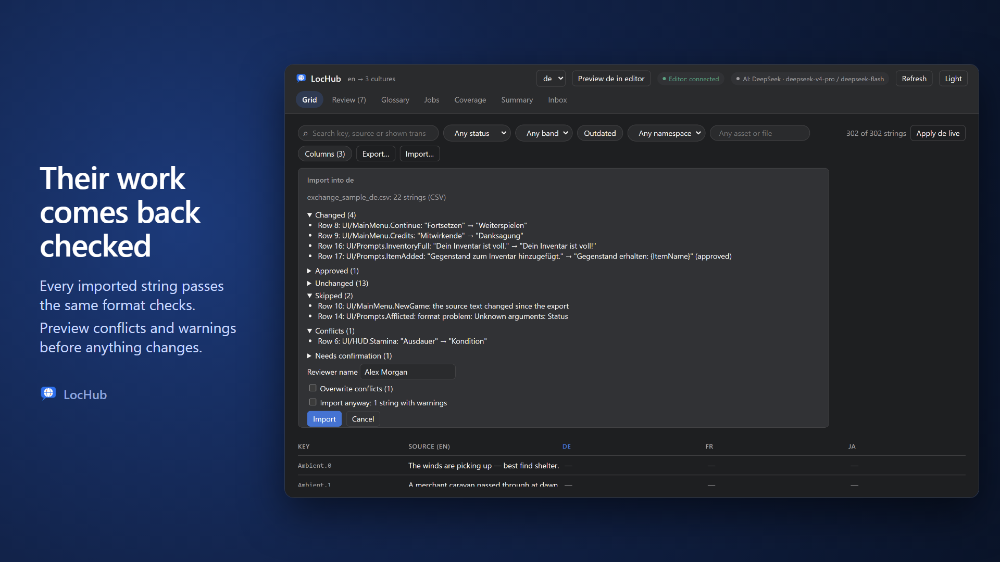
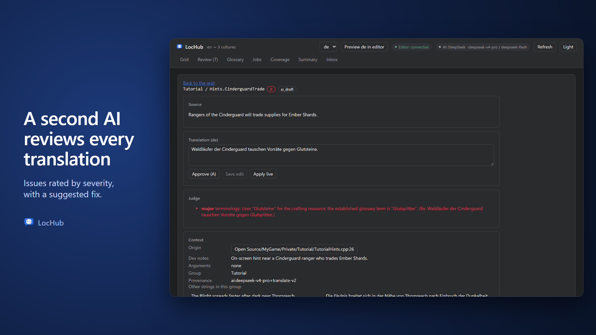
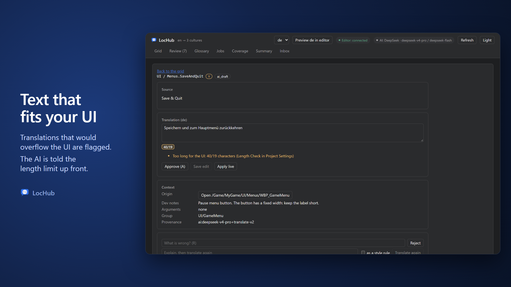

# Grid and Review

LocHub's web UI has six tabs: **Grid**, **Review**, **Glossary**, **Jobs**, **Coverage** and **Inbox**. This page
covers the first two — the Grid, where you browse and filter every string, and the Review queue, where you work
through translations one at a time.

## The Grid

The Grid is a virtualized spreadsheet of every localizable string in the project. Each row is one string (a
"unit"); columns are **Key** (sticky), **Source** (the native-culture text, sticky), and one column per culture
you have chosen to show.

### Columns

- **Key** and **Source** are always shown and stay pinned while you scroll sideways.
- Every other project culture is available through the **Columns** button in the toolbar. The culture you are
  currently working in (the active culture, chosen in the culture picker) is always shown and cannot be hidden;
  every other culture is a checkbox you can turn on or off. Your choice of extra columns is remembered between
  sessions.
- Clicking a cell for a given culture opens that string in the **Review** queue's cell panel (see below), scrolled
  to that specific string.

### Cell statuses

Each cell shows the translated text plus a small status badge:

| Badge | Meaning |
|---|---|
| *(none)* | Empty — nothing translated yet |
| Draft | An AI draft awaiting review (badge color follows the triage band, below) |
| Needs fix | The AI draft failed an automatic format check (see [Format checks](#format-checks)) or Pull refused it; it does not ship until a human fixes it or approves it anyway |
| Approved | A human approved the AI draft as-is |
| Edited | A human edited the AI draft before approving it |
| Human | The translation was written by a human from scratch |
| Rejected | A human rejected the draft; it goes back to translation |
| Outdated | The cell has text, but the source string (native culture) has changed since it was translated |

A cell still loading shows "Loading…"; a cell whose fetch failed renders blank instead of loading forever.

### Triage bands (R / Y / G)

Every AI draft is triaged into a band that only affects **review priority** — it never decides what can ship
(see Settings reference for the release policy that controls that):

- **Red (R)** — the draft failed a format check (either kind), was refused, has a judge issue rated major or critical, or (for
  strings used in UI widgets) an ambiguity the model had to guess at. Review this first.
- **Yellow (Y)** — the model was unsure about context or had to guess (unless the string is UI widget text, which
  goes to Red instead), or the judge or the deterministic checks raised something minor.
- **Green (G)** — clean: no ambiguity, no judge issues, no precheck issues.

A small, stable share of Green cells (about 4% by default) is still sampled into the Review queue as a **blind
audit** — a spot check on what triage might be missing. An audited cell keeps its Green look in the Grid; only the
Review queue treats it specially (see below).

### Filters and search

The toolbar above the Grid offers:

- **Search** — matches the key, the source text, and the text of every currently loaded culture column. Search is
  debounced (a short pause after you stop typing) so a fast typist does not re-filter 50,000 rows on every
  keystroke.
- **Status** — Any status, Untranslated, Draft, Needs fix, Approved, Edited, Human, Rejected.
- **Band** — Any band, Red, Yellow, Green, or No band (strings that have no cell yet for the active culture).
- **Outdated** — a toggle that shows only cells whose source text changed since they were translated.
- **Namespace** — filters to one namespace (an empty namespace shows as "(empty)").
- **Asset / file path** — an autocomplete text filter over every string's origin path. Type part of a path to see
  matching assets/files and their folders as suggestions, each with a string count; pick a folder suggestion
  (shown with a trailing `/`) to match that folder and everything under it, or pick/type an exact path to match
  only that asset or file.

An active filter shows as a small pill with a **×** to clear it. The string count next to the filters reads "N of
M strings" once the active culture has loaded.

> **Tip:** The Asset filter and the Jobs tab's Group filter (see the Jobs page) use the same folder-matching
> rule — type a folder path ending in `/` to scope to everything under it.

### Key details popover

Clicking a row's **Key** opens a popover with:

- **Namespace** and **Key**.
- **Where** — for an asset-owned string, its asset path and the object/property path inside it ("Member"); for a
  C++ string, the source file and line; otherwise the raw, unparsed origin.
- **Kind** — present only when the string is tagged as UI widget text (`LocHub.Kind = ui`) versus other game text.
- **Group**, **Dev notes**, and any other metadata the manifest recorded for the string.
- An **Open in editor** button (when the editor is connected) or a **Copy path** button (when it is not).

### "Apply \<culture\> live"

The toolbar's **Apply \<culture\> live** button sends every valid translation currently loaded for that culture to
the editor for an instant on-screen preview — without doing a full Pull. It skips rejected and needs-fix cells and
does nothing if the editor is not connected. Use it to spot-check how a batch of translations actually looks in
the game before publishing it through Pull.

## Export and import (CSV, XLIFF)

Hand strings to human translators — a vendor working in a CAT tool (Trados, memoQ, Phrase, Crowdin) or volunteers in
Excel or Google Sheets — and bring their work back through the same format checks as your own edits.

### Export

**Export…** in the Grid toolbar opens a small panel:

- **Culture** — the culture to export (the Grid's active culture by default).
- **Format** — **CSV** for spreadsheets, or **XLIFF 1.2** for CAT tools.
- **Strings** — **Strings matching the current filters** (exactly the rows the Grid shows right now, whichever culture
  you export) or **All strings**.

The file is saved as `lochub-<culture>.csv` or `lochub-<culture>.xlf`, in UTF-8.

XLIFF names the source language, which is the target's native culture as reported by Push: until LocHub has had
a Push (for example right after updating from LocHub 1.1), XLIFF export is unavailable. Push, then click Refresh.

**CSV columns**, in this order: `namespace`, `key`, `source`, `translation`, `status`, `context` (where the string
comes from), `notes` (developer notes), `max_length` (the UI length limit, when Length Check gives the string one),
`lochub_id` and `lochub_revision`. Keep `lochub_id` and `lochub_revision` in the file you get back: they identify the
string and let LocHub notice a string that changed while the file was away. A cell that starts with `=`, `+`, `-` or
`@` is written with a leading tab, so a spreadsheet does not run it as a formula; the import removes exactly that tab.

**XLIFF 1.2**: one `<trans-unit>` per string, with the developer notes and the origin as `<note>`s, the UI length
limit as `maxwidth`, and `approved="yes"` on approved strings. The target `state` follows the LocHub status:

| LocHub status | XLIFF `state` |
|---|---|
| Draft, Needs fix | `needs-review-translation` |
| Edited, Human | `translated` |
| Approved | `final` |
| Rejected, Outdated | `needs-translation` |

Format arguments without a modifier (`{Name}`, `{0}`) and rich-text tags (`<Bold>`, `</>`, ``) are
written as protected `<ph>` placeholders, so the CAT tool keeps them intact. An argument with a plural, ordinal or
gender modifier (`{Count}|plural(one=…,other=…)`) stays plain text, since its branches need translating; the format
check on import catches a broken one. XLIFF cannot store a few control characters at all; if a string holds one, the
export names it — export CSV instead, or filter that string out.

In both formats, a translation whose source text changed since it was made reads **outdated** (CSV `status`) /
`needs-translation` (XLIFF `state`).

### Import

**Import…** in the Grid toolbar reads a `.csv`, `.xlf`, `.xliff` or `.xml` (XLIFF) file into the Grid's active
culture. Nothing changes until you confirm: LocHub first shows a preview.

- A CSV needs a `translation` column and either `lochub_id` or both `namespace` and `key`. The column order does not
  matter; columns LocHub does not know are listed as ignored. Write `approved` in the `status` column to approve a
  string along with its translation.
- An XLIFF file whose `target-language` is another culture is refused before anything is sent. `approved="yes"` on a
  `<trans-unit>` approves the string. A target the CAT tool pre-filled with the source text and left in state `new` or
  `needs-translation` counts as no translation.
- The file can be UTF-8 (with or without a BOM) or, for XLIFF, UTF-16. In the editor tab, the file picker reads files
  up to 10 MB.
- Opening the CSV directly in Excel or Google Sheets can turn `lochub_id` into a number (and a `source` or
  `translation` cell that looks like a date or a fraction into one too); reopen it instead through **Data > From
  Text/CSV** with every column set to **Text**. If an id gets mangled anyway, the import still finds the string by
  its `namespace` and `key`.

The preview sorts every string of the file into groups:

| Group | What it means |
|---|---|
| **Changed** | A new translation; marked "(approved)" when the file approves it too |
| **Approved** | The same text as in LocHub, and the file approves it |
| **Unchanged** | Nothing to do |
| **Skipped** | Not imported: the source text changed since the export, the string is not in the project, the translation is empty (an import never clears a translation), or the text has a problem Unreal would reject (see [Format checks](#format-checks)) |
| **Conflicts** | The string changed in LocHub after the file was exported: it has a newer revision, or — for a file without `lochub_revision` / `lochub:revision` — a history entry after the XLIFF file's `date` |
| **Needs confirmation** | The text has warnings only (see [Format checks](#format-checks)) |

To import, enter your **Reviewer name** (required; the browser remembers it): it is recorded on every imported string
and in its history. **Overwrite conflicts (N)** imports the conflicting strings too; **Import anyway: N strings with
warnings** imports the strings whose only issues are warnings. Each checkbox updates the preview, so what you see is
what **Import** does. Strings with a problem Unreal would reject are never imported.

What an import does: a changed translation becomes **Edited** (or **Approved**, when the file approves it), written by
you; approving an unchanged translation makes it **Approved**. A translation the file marks approved still lands as
plain **Edited** when LocHub had already approved a different text for that string, or when the row only got in
because you checked **Overwrite conflicts** — either way the approval in the file refers to a string LocHub has since
changed, so a reviewer approves the new text in LocHub instead. Either way the string is human work that translation
jobs never overwrite, and its translation counts as made for the current source text. The Grid refreshes when the
import is done. If the LocHub data files changed on disk while the service ran (a source-control sync), the import is
refused and nothing is written. **Import** refuses the same way if the strings themselves changed since the preview
was shown — another edit, an AI job, a Push, or a retry after that files-changed refusal: nothing is written, and
the panel shows the fresh preview so you can check it before trying again.

## The Review queue

The **Review** tab is a focused, one-string-at-a-time view built from the same data as the Grid, filtered and
sorted for reviewing.

### What's in the queue, and in what order

The queue includes, for the active culture:

1. Every **Needs fix** cell, first.
2. Every **Red**-band draft.
3. Every **Yellow**-band draft.
4. Every **Green**-band draft that happens to be one of the blind-audit samples.

Plain Green drafts that are not part of the audit sample never appear in the queue — they ship without review
under the default release policy. Inside the queue, the audited Green cells look exactly like any other card (the
triage band is hidden while reviewing), so a reviewer cannot tell a genuine audit check from a Yellow/Red item by
sight.

### Keyboard shortcuts

The queue bar shows your position ("N / M") and the shortcut legend:

| Key | Action |
|---|---|
| `J` | Next string |
| `K` | Previous string |
| `A` | Approve (never for a text with warnings — that takes a click on **Approve anyway**) |
| `E` | Focus the translation text box for editing |
| `1` / `2` / `3` | Fill the translation with alternative 1 / 2 / 3, if the model offered any |
| `R` | Focus the reject-reason field |
| `N` | Focus the "ask for context" field |
| `Esc` | Leave the currently focused field |

Shortcuts are disabled while a text field has focus (so typing a translation never accidentally approves or
rejects it) — except `Esc`, which always works and blurs the field.

If a job finishes and re-sorts the queue while you are reviewing, the queue keeps you on the same string rather
than jumping you to whatever now occupies the same numeric position.

## The cell panel

Whether opened from the Grid or from the Review queue, the cell panel shows everything needed to judge one
translation:

- **Header** — namespace / key, the triage band chip (hidden in the Review queue), the status chip, and an
  "outdated" chip if the source moved since this text was translated.
- **Source** — the source text (in the target's native culture); if outdated, also "Translated from: \<the older source text\>".
- **Translation** — an editable text box, a **length counter** under it when the string has a Length Check limit
  (visible characters of your text / the limit, highlighted once the text is over), the format check of the current
  text (it runs as the panel opens and again as you type; see [Format checks](#format-checks)), and the action
  buttons:
  - **Approve (A)** — approves the text as shown. If you have edited the box first, this instead saves your edit
    and approves it (a human edit is recorded, not a plain approval). Reads **Approve anyway** when the text has
    only warnings.
  - **Save edit** — saves your edit without approving (enabled only once you've changed the text). Reads **Save
    anyway** when the text has only warnings.
  - **Apply live** — pushes just this one string into the editor for an instant preview, without waiting for a
    Pull; disabled when the editor is not connected or the box is empty.
  - A **suggestion** line with a **Use suggestion** button, when a retranslate produced one.
  - Up to three **alternatives** the model offered, each with its own **Use N** button.
- **Judge** — any issues the judge model raised (severity, category, why, and a suggested fix), when present.
- **Model question** — the ambiguity question the translator model asked, if it had one.
- **Context** — the string's origin (with an **Open in editor** / **Copy path** action), dev notes, any
  `{Argument}`-style interpolation placeholders found in the source, its group key, and its provenance (for
  example `ai:claude-opus-5-5+<prompt version>` or `tm:<donor unit id>` for a translation-memory reuse).
  Up to eight other strings sharing the same group are listed alongside their own translation, for consistency
  checks.
- **Forms**:
  - **Reject** — an optional reason plus a Reject button; the string goes back to translation and is always sent
    to the model again on the next job (rejected/needs-fix cells never reuse a cached answer).
  - **Retranslate** — a required note explaining what to fix, an **as a style rule** checkbox (also appends the
    note to the culture's style guide), and a **Translate again** button. This produces a new **suggestion**, it
    does not overwrite the current translation.
  - **Ask for context** — a question sent to the **Inbox** (see the Jobs/Inbox/Coverage page) for a human to
    answer later.
- **History** — every recorded event for this cell (timestamp, actor, action, before/after text), or "No changes
  yet." An approve or edit made despite warnings names them, for example "approved anyway (args_missing)".

If the string changed on the service since the panel loaded (someone else approved it, or a job overwrote it), any
action you take is refused with a message explaining the string changed, and the panel refreshes to the current
text instead of silently overwriting it.

## Format checks

Every translation — an AI draft, your edit, or the text you are about to approve — goes through the same format
check. It finds two kinds of problems.

**Problems Unreal would reject** (the text would fail Unreal's own validation or show up broken in the game). Approve
and Save stay disabled, with the hint "Fix the problems above first":

- The translation is empty (`empty`).
- An unmatched `{` or `}`, a broken `|plural(...)`-style modifier, or a plural form name Unreal cannot read — the
  player would see the raw text (`syntax`).
- An `{Argument}` the source does not have: the game never fills it in, so it shows as `{Argument}` (`args_extra`).
- A `|plural`/`|ordinal` modifier in a language that has only one form for it (`plural_redundant`).
- A plural form the language needs is missing (`plural_forms_missing`), or one it does not use is present
  (`plural_form_unused`). LocHub uses the plural forms your version of Unreal itself reports for each language,
  sent with every Push, since Unreal's language data can differ from newer tables.
- Rich-text tags that are not balanced — every `<Tag>` needs a closing `</>`, unless the source is unbalanced the
  same way (`rich_tags_unbalanced`).

**Warnings** (Unreal accepts the text, but it looks wrong):

- An `{Argument}` of the source is left out (`args_missing`) — fine when the phrase does not need it, for example
  a count the sentence does not repeat or a gender the language does not have.
- The source's `|plural(...)` modifier was dropped (`plural_dropped`).
- The rich-text tags differ from the source, for example one styled span split in two (`rich_tags`).
- A glossary term marked "Do not translate" is not kept exactly as written (`dnt`).
- A plural form name Unreal does not know and simply ignores (`plural_unknown_form`).

When the text has only warnings, the panel shows them in a yellow box under the line "Unreal accepts this text,
but it looks wrong. Approve anyway if it is intended.", and the buttons read **Approve anyway** and **Save
anyway**. Clicking one records the warnings you confirmed in the string's history. The `A` key never approves a
text with warnings; it shows "Check the warnings, then click Approve anyway." If the warnings changed since the
panel checked the text (for example, someone added a glossary term), the service refuses the click and shows the
new list.

**Too long for the UI** (`too_long`, from the [Length Check](06_Settings_Reference.md#length-check)): the text has
more visible characters than the string's limit, for example "Too long for the UI: 40/19 characters (Length Check in
Project Settings)". With **Length Severity** set to **Warning** (the default) it is a hint: it shows in the problem
list, puts the string in band Y and blocks nothing. With **Must Confirm** it is a warning like the ones above: the
buttons read **Approve anyway** and **Save anyway**. The counter under the edit box shows the same count while you
type. Placeholders and tags count 0 and Chinese, Japanese and Korean characters count 2, so the counter may differ
from a plain character count.

A translation job holds its own drafts to both kinds: a draft with a problem or a warning goes back to the model
for a fix and, if it still has one, is marked **Needs fix** — nothing suspicious ships without a human deciding.
"Identical to the source" is only a hint and never blocks anything.

On Pull, the plugin checks every translation with Unreal's own validator once more and refuses only what Unreal
refuses (plus characters missing from your glyph-check fonts), so a text you approved anyway is written like any
other.
