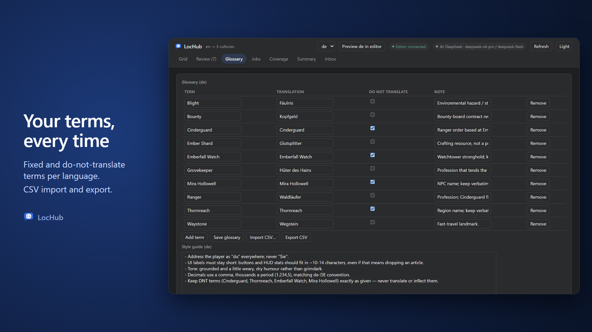
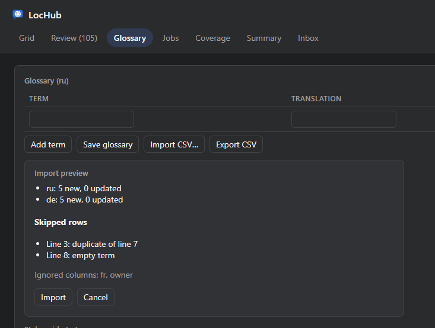

# Glossary

The **Glossary** tab holds two culture-scoped tools: a term list that every translation job reads, and a free-text
style guide. Both are per culture — switching the active culture shows that culture's own glossary and style
guide. A project-wide brief for all cultures lives in Project Settings; see [Project brief](#project-brief) below.

## Terms

Each row is one glossary term:

| Column | Meaning |
|---|---|
| Term | The source-language word or phrase to match (case-insensitive) |
| Translation | How to render it in the active culture |
| Do not translate | When checked, the term must be kept exactly as written — Translation is disabled for that row |
| Note | Free-text guidance for the translator model (for example, gender or grammatical case) |

Use **Add term** to append a blank row, the row's **Remove** button to delete it, and **Save glossary** to write
your changes. A blank Term is silently dropped on save; saving refuses the whole list if any *other* required
field is missing.

### "Apply to N strings"

After a successful save, LocHub compares the glossary you just saved against AI drafts (status **Draft**, not yet
approved or edited) whose source text uses a changed term but whose current translation does not follow it. For
each such term, a banner appears:

> "\<term\>" appears in N \<culture\> AI drafts that do not follow it. **Apply to N strings**

Clicking it rejects every one of those drafts with a note such as `Glossary: translate "Sled" as "Nartas".` (or,
for a do-not-translate term, `Glossary: keep "Sled" untranslated.`). A rejected string is always resent to the
model on the next translation job — it never reuses a cached answer — so the new glossary rule reaches it on the
next run. Human-approved or human-edited translations are never touched by this: a human decision always wins.

> **Note:** Importing a CSV (below) triggers the same "Apply to N strings" check for whichever terms actually
> changed.

## Style guide

A single free-text box per culture, saved with **Save style guide**. It travels to the model with every
translation and repair request for that culture, alongside the glossary.

## Project brief

One text for the whole project, shared by every culture: what the game is, its setting and tone, who the player
is, and anything else a translator should know before touching a single string. Set it in **Project Settings >
Plugins > LocHub > AI > Project Brief** — there is no editor for it in the LocHub tab.

The brief goes to the translator and to the AI judge with every request, before the style guide and the glossary.
A change applies to the running service automatically, the same way an AI Provider or model change does: right
away, or — while a translation job is in progress — right after that job finishes. No restart step is needed.

## CSV import and export

### Export

**Export CSV** writes the current (saved) term list — blank rows excluded — as `glossary-<culture>.csv`, either
through the editor's native save dialog (in the editor tab) or as a browser download. The file:

- has the exact header `term,translation,dnt,note`;
- uses a comma as the delimiter and `\r\n` line endings;
- writes `dnt` as the literal word `yes` or `no`;
- quotes a field only when it contains a comma, a quote or a newline, doubling any embedded quote (standard CSV
  quoting);
- is UTF-8; a value that would otherwise be read by Excel/Sheets as a formula (starting with `=`, `+`, `-` or `@`)
  is prefixed with an invisible tab so it round-trips as plain text instead of executing as a formula. Importing
  the exported file back trims that guard off, so the round trip is exact.

### Import

**Import CSV…** opens a file picker (in the editor tab) or a browser file input, decodes it as UTF-8 (a BOM is
stripped automatically; a file that is not valid UTF-8 is rejected with "The file is not UTF-8. Save it as \"CSV
UTF-8\" and import again."), and auto-detects the delimiter — comma, semicolon or tab, whichever appears most often
in the header row (a tie keeps comma).

The first row must name the columns. Column names are matched case-insensitively, trimmed, and any column
LocHub does not recognize is ignored (and listed as "Ignored columns" in the preview):

| Column meaning | Recognized header names |
|---|---|
| Term (required) | `term`, `source`, `source term` — or, if none of those is present, a column literally named after the project's native culture |
| Translation | `translation`, `target` — fills the **currently active** culture |
| Per-culture translation | A column named after any project culture code (`ru`, `pt-BR`, `pt_br`, `PT-br`… are all recognized as the same culture) |
| Do not translate | `dnt`, `do not translate`, `keep` — accepted values: `yes`/`y`/`true`/`1`/`x`/`+` for true, `no`/`n`/`false`/`0`/`-`/empty for false |
| Note | `note`, `comment` |

You can mix a plain `translation` column with one or more culture-named columns (for example `translation` for the
culture you're on, plus `de` and `fr` for the others) — each culture column is imported and merged separately, so
one CSV can update several cultures at once. `translation` and a column named after the *same* active culture may
not both be present (LocHub refuses with an error naming the conflict). If the file has no translation column of
any kind but does have a `dnt` column, every "yes" row is treated as a do-not-translate term for the active
culture.

Rows are skipped (and listed, with line number and reason, up to 20 in the preview) when:

- the term is empty ("empty term");
- the term repeats an earlier row's term, case-insensitively (only the later row is kept — "duplicate of line N");
- the file has no translation for that row and no `dnt: yes` either ("no translation");
- a `dnt` cell holds something other than a recognized yes/no value.

The import preview shows, per culture found in the file, how many terms would be added and how many updated
against what is currently saved — nothing is written until you click **Import**. Only fields the incoming row
actually sets are applied to an existing term (an empty Translation or Note cell never clears a value that is
already there); `dnt` is always applied when the column is present, since `false` is itself a meaningful value.
Confirming re-reads and re-merges each culture's glossary right before saving it (in case it changed on the
service since the preview opened), and if one culture's save fails partway through, the ones that already saved
are kept and the failure is reported rather than silently discarded.

> **Note:** Import is blocked — "Save your glossary changes before importing." — whenever the on-screen term list
> differs from the last saved one for the active culture. Save (or discard) your edits first.

