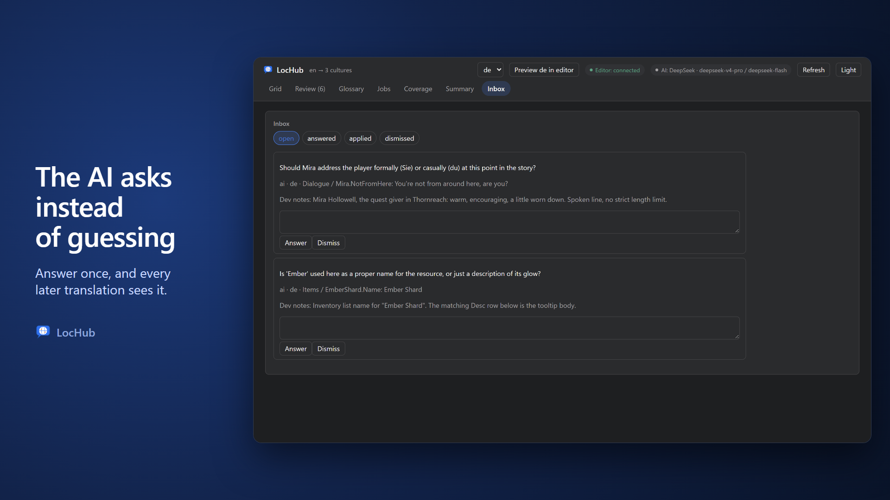
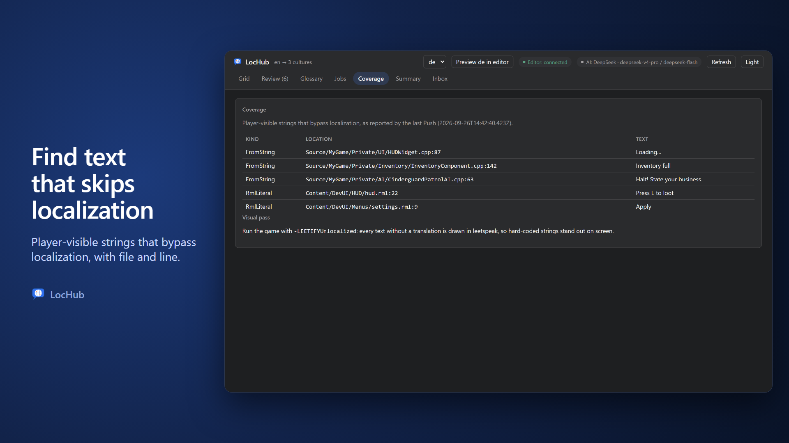

# Jobs, Inbox and Coverage

## Jobs

The **Jobs** tab runs a translation pass for the active culture — estimate its cost first, then run it.

### Scoping a job

- **Group** — an autocomplete path filter over group keys (the same folder-matching widget as the Grid's Asset
  filter): leave it empty for every group, type an exact group key to scope to just that group, or type a path
  ending in `/` to scope to that folder and everything under it.
- A selection made in the Grid can also arrive here as a fixed set of strings; when it does, the panel shows
  "N selected string(s)" with a **Clear selection** button.

### Estimate

**Estimate** is disabled while a job is already running for this culture, or while the configured AI provider is
not ready (missing API key; under Claude Subscription auth, Claude Code not found or not signed in; etc. —
hover the button for why). Once it returns, one of these appears:

- **Nothing in scope**: "No strings match this group." (a Group filter matched nothing) or "Nothing to
  translate." (the whole culture is already done) — no Run button.
- **Fully covered by reuse**: "N strings reuse translation memory or cached answers — no translate cost is
  estimated; judging may still run." plus a **Run** button — no Max USD needed, since no model call for
  translation happens either way.
- **No dollar figure to show** (a model with no known price): "≈ N strings in M requests · ≈ X input / Y output
  tokens" plus "price unknown for this model", and a **Run** button with no Max USD field.
- **Normal, priced estimate**: "N strings in M requests · X input / Y output tokens · estimated \$Z" plus a
  **Max USD** field (pre-filled about 20% above the estimate) and **Run**, disabled until Max USD covers the
  estimate.

While it runs, the button reads **Estimating…** and a status line below it says "Estimating the cost…". For
Anthropic with an API key, LocHub counts several groups' tokens with the provider at once instead of one at a
time, and remembers every group it has already counted for as long as the service keeps running — so **Run**
right after **Estimate**, or a repeated **Estimate** of the same scope, does not count those groups again. If
the provider rate-limits or is overloaded while counting a group, that group falls back to a local,
approximate count instead of failing the whole estimate. Every other provider, and Claude Subscription auth,
never counts tokens exactly in the first place, so their estimate is always approximate. Either way, the
estimate is marked "≈ Approximate: token counts are estimated from text length; the job report shows the real
usage."

An estimate is a best case, not a hard ceiling: the translate model may think adaptively (billed as output
tokens), and precheck repair rounds or provider-side retries are not counted in it.

### Run without estimate

Next to **Estimate** is **Run without estimate**: it starts the job right away, with no cost estimate and no
**Max USD** limit — the finished job's own report still shows the real cost. It is disabled under the same
conditions as **Estimate** (a job already running for this culture, or the AI provider not ready), plus while
an estimate or another job start is already in flight.

**Translation memory (TM) reuse**: if a unit's English source text exactly matches one already translated and
approved/edited/human-written elsewhere in the project, the job reuses that translation directly — no model call,
no cost. TM reuse (and any cached answer from an earlier identical request) is not counted in the estimate's
`items`, only in its overall `strings` total.

### Running a job

Reopening the Jobs tab (switching culture, or coming back to the tab) automatically resumes whatever job is
currently running — or shows the report of the last finished one — for that culture, so a running job is never
"lost" by navigating away. While running, a progress bar shows the current phase (Translating, Fixing, Checking,
Writing) with a strings-done / strings-total count. Starting a job while one is already running for that culture
does not start a second one — it shows you the one already in flight.

Once a job ends, the report line reads:

> Written W · suggestions S · needs fix N · refused R · errors E · questions Q · R x / Y y / G z · N input /
> M output tokens

- **Written** — new AI drafts.
- **Suggestions** — a translation that landed as a suggestion instead of overwriting the cell, because a human
  touched that cell while the job was running.
- **Needs fix** — drafts that still failed an automatic format check after the repair round (a problem Unreal would
  reject, or a warning); a human fixes them or approves them anyway before they ship (see Grid and Review, "Format
  checks").
- **Refused** — the model declined to translate the string.
- **Errors** — a provider/network failure for that string, after retries.
- **Questions** — new Inbox questions raised by the model's own ambiguity about a string.

**Error reasons**: when a job reports errors (or a judge failure), up to three distinct, redacted error messages
appear underneath the report line — enough to act on (a wrong model id, an invalid key, no credit) without an
unexplained error count. A judge failure is listed the same way, prefixed `Judge:`, but is never counted in
**errors** — the translation itself may still be fine. If every request of the very first round fails with the
same kind of hard, non-retryable error, the whole job stops immediately and reports as failed instead of writing
a grid of unexplained needs-fix cells — nothing already reused from translation memory is lost.

If the service restarts mid-poll, the panel shows "Job status unknown — the service may have restarted." — job
records live only in memory and do not survive a restart.

## Inbox

Translator models sometimes ask a clarifying question about an ambiguous string instead of guessing blindly; a
reviewer can also ask their own question from a cell panel's **Ask for context** field. Both land in the
**Inbox**, scoped to the active culture, under four tabs: **open**, **answered**, **applied**, **dismissed**.

Each entry shows the question, who asked (the model, or `reviewer`), the culture, and the string it is about
(namespace / key / source text — or "unit no longer exists" if that string was retired since). An **open**
question has an answer box and **Answer** / **Dismiss** buttons.

### How an answer reaches the translator

An answered question is not a one-off reply — it becomes part of that string's permanent context:

1. The next translation job for that string always includes every answered question and its answer in the
   prompt, regardless of engine version.
2. On the next **Pull**, the plugin fetches every answered question, merges the question/answer pair (as a
   `Q: <question> A: <answer>` line, de-duplicated) into the string's **developer notes**, and marks it
   **applied**.

> **Note:** Writing translator answers into developer notes needs **Unreal Engine 5.8 or later** (developer notes
> on `FText` and String Table entries do not exist before 5.8). On UE 5.6 and 5.7, Pull leaves answered questions
> as **answered** — they are never marked applied, and Pull's details say so — but the translator model still sees
> them, since that part of the prompt does not depend on engine version.

On UE 5.8+, Pull writes straight into the asset that owns the text (or the String Table entry) when it can. It
falls back to a proposal in `Saved/LocHub/DevNotesProposals.md` — listing the exact note to add and why it could
not write it automatically — when:

- the project setting **Write dev notes to assets** (Project Settings > Plugins > LocHub) is off, or
- the string is defined in C++ (there is no asset to write into), or has no usable origin at all.

The proposals file spells out the manual fix for a C++ string (replace `LOCTEXT(Key, Text)` with
`NOTELOCTEXT(Key, Text, Notes)`, and `NSLOCTEXT` with `NSNOTELOCTEXT`) — after applying it, re-run Gather Text and
Pull again; the question is considered closed once the manifest carries the note.

## Coverage

The **Coverage** tab lists player-visible strings that bypass localization entirely — text a Push found hard-coded
instead of going through the normal text system. It reflects the most recent real Push (not a dry run), and shows
that Push's timestamp.

Two kinds of findings:

| Kind | What it is |
|---|---|
| `FromString` | A C++ call that builds an `FText` from a literal string (`FText::FromString("...")`) instead of a localized source, found under the project's own source folders |
| `RmlLiteral` | Visible, hard-coded text inside a RmlUi `.rml` document (comments, `<head>`/`<style>`/`<script>` blocks and `{{bindings}}` are not counted) |

Each finding lists its kind, its file and line, and the offending text. Folders matching the project's coverage
exclude patterns (by default: editor-only source, `Tests`, `ThirdParty`, and generated headers) are never scanned.
"No findings." means the last Push found nothing.

> **Tip:** For a visual pass, launch the game with `-LEETIFYUnlocalized`: every string that has no translation is
> rendered in leetspeak, making any hard-coded (never-translatable) text stand out immediately on screen.

