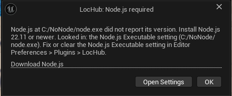

# Troubleshooting and FAQ

## Troubleshooting

### Node.js was not found (or is too old)

LocHub needs a local Node.js 22.11 or newer to run its service; the editor checks this at startup and, if
anything is wrong, opens a **"LocHub: Node.js required"** window naming the problem, with a **Download Node.js**
link and an **Open Settings** button.

LocHub looks for Node.js in this order, stopping at the first one that works:

1. The per-user setting **Editor Preferences > Plugins > LocHub > Node.js Executable**, if you have set one — when
   set, only that exact path is used.
2. `PATH`.
3. The usual install locations for the current OS (macOS: `/opt/homebrew/bin`, `/usr/local/bin`,
   `/opt/local/bin`; Linux: `/usr/bin`, `/usr/local/bin`, `/snap/bin`; Windows: the `Program Files\nodejs` folder,
   and Volta's install folder).
4. Version managers (nvm, fnm, asdf, mise) — the newest suitable version any of them has installed.
5. macOS/Linux only: the user's login shell, in case Node.js is only set up there.

If none of these finds a working Node.js, the window lists exactly where it looked. Install Node.js 22.11+, or
point the **Node.js Executable** setting at an existing install, then restart the editor.

### Port already in use

The **Service Port** setting (Project Settings > Plugins > LocHub > Service, default `47810`) is shared across
every project on the machine. If another project's LocHub service already owns that port, LocHub refuses to touch
it and reports:

> Port \<N\> is used by the LocHub service of \<other project path\>; set another Service Port in Project
> Settings > Plugins > LocHub.

Pick a different Service Port for one of the two projects and reopen LocHub (or restart the editor).

### The service runs but does not answer

If something is listening on the configured port but never answers a health check, LocHub reports:

> The LocHub service runs but does not answer \<url\>/api/health. Use **Tools > LocHub > Restart Service**.

Use that menu command; if it keeps happening, check the log path the message names.

### "Outdated build" — the service does not report its project

A LocHub service left running from an older version of the plugin cannot be identified as belonging to any
particular project, so LocHub refuses to adopt or use it:

> The service on port \<N\> does not report its project (an outdated LocHub service). End node.exe pid \<N\>
> (named by `Saved/LocHub/service.pid`) or restart it where it runs.

End the `node.exe` process the message names (Task Manager on Windows, Activity Monitor or `kill` on macOS/Linux),
or just restart the editor — either way, the next Push, Pull or Open LocHub starts a fresh service from the
plugin version you have installed.

### An AI provider's key is not set

**Estimate** and **Run** on the Jobs tab, and the equivalent job endpoints, refuse to run when the active
provider needs an API key and none is set, with this message:

> No API key: enter it in Project Settings > Plugins > LocHub > AI > API Key.

Open **Project Settings > Plugins > LocHub > AI**, confirm the right provider is selected, and enter its key
in the **API Key** field directly below (masked while typing). The change applies to the running service on
its own — right away, or, if a translation job is currently running, right after that job finishes; no editor
restart needed.

### Claude Code was not found (Claude Subscription auth)

When **Anthropic Auth** is **Claude Subscription**, **Estimate** and **Run** refuse to start if the `claude`
CLI is not on `PATH`, with this message:

> Claude Code (claude) was not found on PATH.

Install [Claude Code](https://claude.com/product/claude-code) so `claude` is reachable on `PATH`, then retry
— no editor restart needed, LocHub re-checks readiness on its own.

### Claude Code is not signed in

Still under **Claude Subscription** auth, if `claude` is installed but has never been signed in (or the
sign-in has expired), LocHub reports:

> Claude Code is not signed in: run "claude" once and sign in.

Open a terminal, run `claude`, and sign in to your Claude subscription; then retry **Estimate** or **Run**
from the Jobs tab.

### A Claude Subscription request timed out

A single translate or judge request run through Claude Code is killed and reported as an error if it takes
longer than 10 minutes to answer. It appears in the job's **Error reasons** like any other provider error,
and is retried the same way a transient provider failure is.

### A job failed with an error

The job report's **Error reasons** list (up to three, secrets redacted) names what actually went wrong — a bad
model id, an invalid key, no credit on the account, and so on. If every request in the job's first round fails the
same way, the whole job is marked failed before touching any string, rather than leaving a grid of unexplained
"needs fix" cells.

### "Localization/LocHub changed on disk since the service loaded it"

Something (typically a source control sync — `git pull`, `p4 sync`, and the like — while the service kept running)
changed a data file the service already has in memory. Every write is refused with this message until you restart
the LocHub service, which reloads the current files from disk.

### A review action says the string changed

Approving, editing or rejecting a cell that changed since you opened it (someone else acted on it, or a job
overwrote it) is refused, and the panel refreshes to the current text instead of applying your now-stale action.
Just review it again.

### macOS: a project path with two consecutive spaces

A known limitation: if the project's folder path contains two consecutive spaces, the LocHub service fails to
start on macOS, because macOS collapses repeated spaces when passing command-line arguments to a new process.
Avoid double spaces in the project's path on macOS.

### Changing AI settings while a job is running

A change to the AI provider, auth mode, API key or model in Project Settings does not restart the service
immediately if a translation job is currently running for this project — it is applied automatically as soon
as that job finishes. The editor lets you know this is pending rather than silently keeping the old settings.

## FAQ

**What text is sent to the AI provider?**
Only what a translation or judge request actually needs for the strings in scope: the source text; where each
string comes from (the asset or C++ file and line), its developer notes, format arguments and metadata; for an
outdated string, the previous source and translation; reviewer notes and answered translator questions for that
string; neighboring strings from the same group (for consistency); and, per culture, the project brief, the style
guide and the glossary. Nothing else about the project is sent.

**What is sent to whom under Claude Subscription auth?**
The same request content as under API Key auth (see "What text is sent to the AI provider?" above) — the
difference is only how LocHub reaches Anthropic. LocHub never hands your Anthropic API key to the service in
this mode (there isn't one to hand over), and it never reads or logs your Claude account e-mail or any
session token. It only asks your own, already signed-in `claude` CLI to run one request at a time, hidden,
with no tools enabled and no session persisted between requests, and reads back its structured JSON result.

**What network access does LocHub need?**
Two destinations only: the configured AI provider's own API endpoint, and `localhost`/`127.0.0.1` — the web UI
in the editor tab talking to LocHub's own local Node service on the configured Service Port. LocHub makes no other
outbound network calls.

**Where does LocHub keep its data?**
`Localization/LocHub/` holds the actual localization data — units, translations, glossary, style guides, the
inbox — and is meant to be committed to source control and merged like any other project file. The project brief
and the API key live in Project Settings > Plugins > LocHub > AI (`Config/DefaultEditor.ini`), not in
`Localization/LocHub/`.
`Saved/LocHub/` holds local, session-scoped state (the service's pid and log files, a job cache, the project
brief snapshot the running service reads, and any pending developer-note proposals) that should not be committed.

**Is LocHub's data friendly to source control?**
Yes — the files under `Localization/LocHub/` are plain, line-oriented text designed to diff and merge cleanly
alongside the rest of the project's source control history, whichever system the project uses (git, Perforce,
Plastic/Unity VCS, SVN, ...).

**Where is the API key stored?**
In `Config/DefaultEditor.ini`, along with the other LocHub project settings — it travels with the project the
same way those settings do, including through whatever version control the project uses. Anyone who can read
the project's config can read the key.

