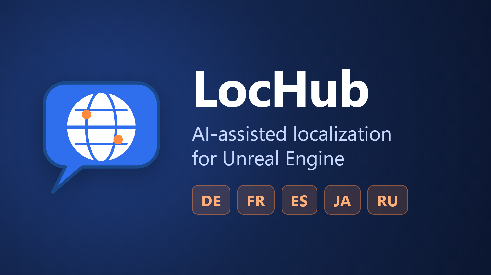
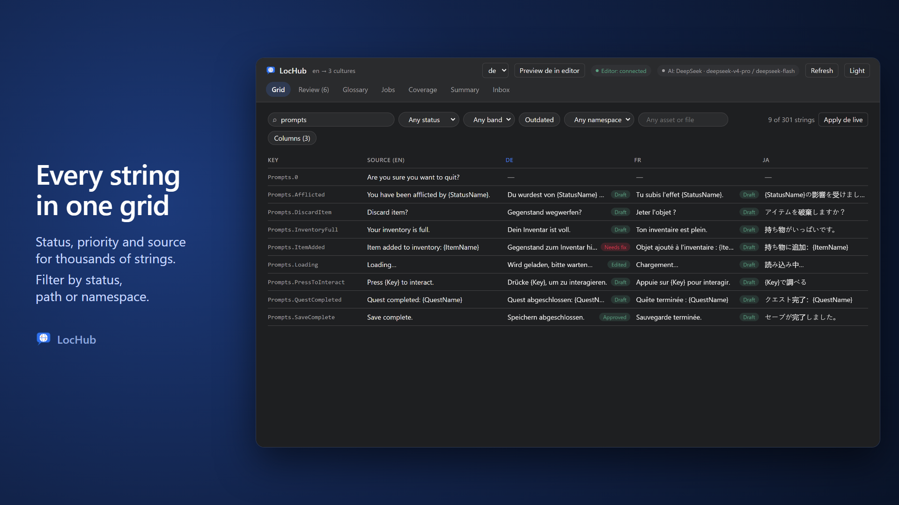
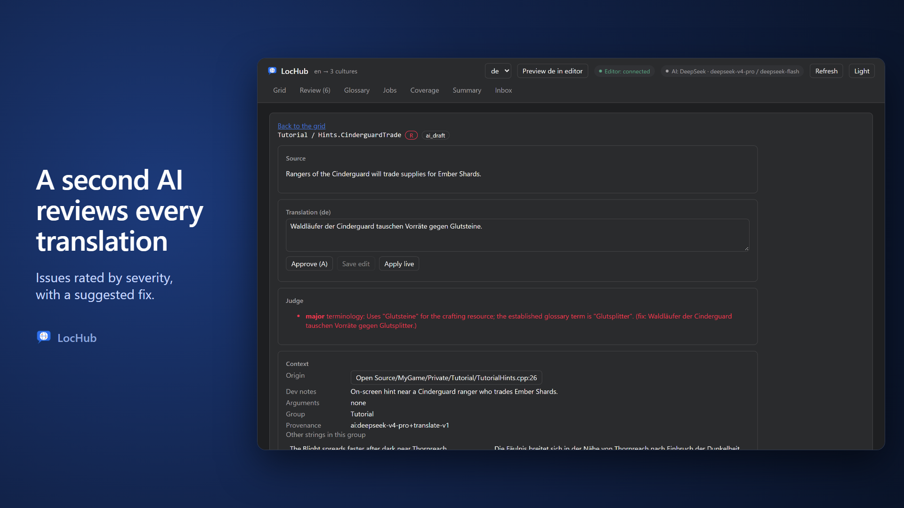
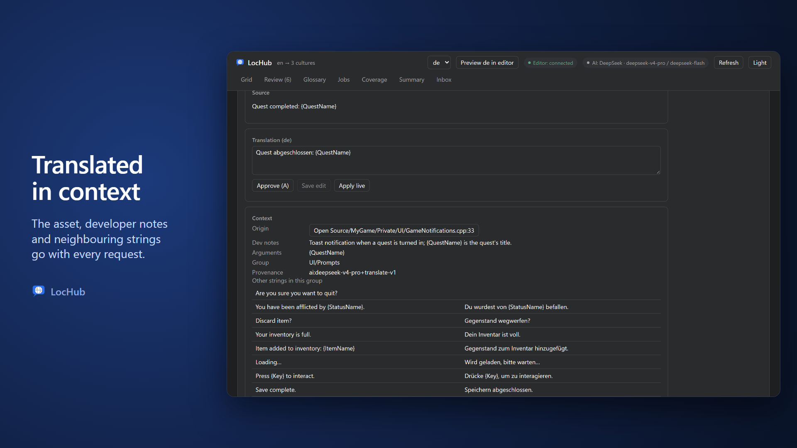
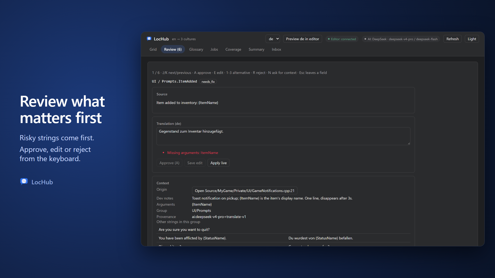
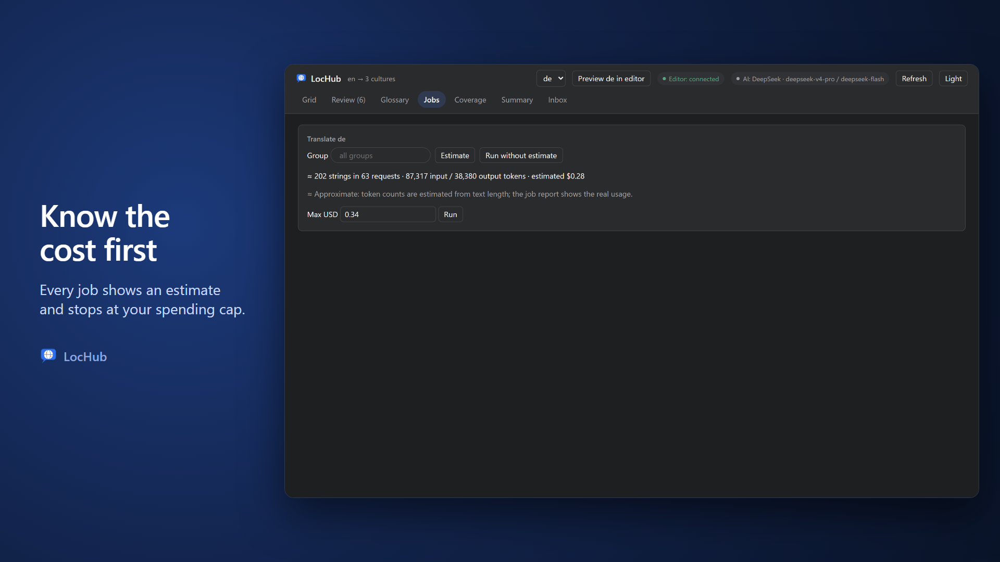

# LocHub

AI-assisted localization for Unreal Engine: translate your project's text with your own AI provider,
review it in one place, and pull it back into the localization archives.

LocHub is source-available under the **Business Source License 1.1**: free to read, modify and use, and
free to run in production for personal projects, education, academic research, game jams, or games given
away free of charge with no monetization of any kind. Any other production use needs a license purchased on
Fab. Each released version converts to the **Apache License 2.0** four years after its publication.

See [`LICENSE`](LICENSE) for the full text.

**Get LocHub on Fab:** [coming soon](https://www.fab.com/) <!-- FAB_URL: replace with the listing URL at release -->

Need a commercial license before the Fab listing is live? Email
[rim2812@gmail.com](mailto:rim2812@gmail.com).



[](LICENSE)








<!-- WHY-LOCHUB:BEGIN — keep this section identical in README.md and Docs/Fab/listing.md. -->
## Why LocHub

**You stay in control**
- **Broken formatting never reaches your game.** Format arguments (`{0}`, `{PlayerName}`), plural forms for
  every target language and rich-text tags are validated in code twice — by LocHub, and again by Unreal's own
  validator right before anything is written. Broken text cannot be approved, not even by hand.
- **A second AI reviews every translation.** An optional judge checks meaning, terminology and tone, rates each
  issue by severity and suggests a fix. Risky strings come first in the review queue.
- **Every string is translated in context.** With the text, the AI gets where it comes from (the asset or C++
  file), its developer notes and metadata, already-translated strings from the same screen or asset, your
  project brief and style guide, and your answers to its earlier questions.
- **Your glossary is followed.** Fixed terms and do-not-translate words go to the translator and the judge with
  every request; do-not-translate terms are also checked in code. Change a term, and every string that uses it
  is queued for re-translation in one click.
- Human edits are never overwritten by the AI.
- Changed source text marks its translations outdated; they are not shipped until updated.
- You choose what ships: only approved strings, or everything that passed the checks.
- Full history per string, a cost estimate before every job and a hard spending cap.

**Pleasant to use**
- Works in an editor tab: a fast grid, filters, and a keyboard-driven review queue.
- Jump from a string to its asset or C++ line; preview a language in the editor live.
- Glossary CSV import/export; the AI asks you questions instead of guessing.

**Simple**
- One click sets up your localization target. No accounts, no servers.
- Bring your own key: Anthropic, OpenAI, xAI, DeepSeek or Google Gemini — or, for Anthropic, your own Claude
  subscription via Claude Code, no key needed.
- Output is ordinary archives and `.locres` — stop using LocHub any time.
<!-- WHY-LOCHUB:END -->

LocHub is an Unreal Engine editor plugin that brings AI-assisted localization into the editor, for teams
who want to translate their project's text with an AI provider of their own choice while keeping a human
in control of what actually ships. It reads and writes your project's existing `.manifest` and `.archive`
localization files — LocHub does not replace Unreal's localization system, it adds an AI-assisted review
workflow around it.

## Features

- **Grid** — a spreadsheet-like view of every string and its translations across all target cultures, with
  filters and jump-to-source.
- **Jobs** — run a translation job over a culture, a group or a folder, with a cost estimate (string count,
  token counts, an estimated USD cost) and a **Max USD** budget before you spend anything.
- **Judge** — an optional second AI pass rates each translation's issues by severity and suggests a fix, so
  the riskiest strings surface first in Review.
- **Review queue** — a keyboard-driven queue for approving, editing or rejecting AI drafts. Translation
  issues come in tiers: a **hard** issue (broken format arguments, dropped rich-text tags, invalid syntax)
  blocks Approve and Save outright; a **confirm** issue (a plural form modifier lost, an argument possibly
  missing) can be approved or saved anyway once a human has looked at it.
- **Glossary** — per-culture terms and do-not-translate words, a free-text style guide, and CSV import/export.
  A project-wide brief (Project Settings > Plugins > LocHub > AI > Project Brief) gives every job shared
  context across all cultures.
- **Inbox** — questions the AI asks instead of guessing reach a per-string inbox; your answer is sent back
  as a developer note on the source text.
- **Coverage** — a report of player-visible strings that bypass localization entirely (a literal
  `FText::FromString`, visible text hard-coded into an RmlUi document), so nothing slips through untranslated.
- **Pull** — write approved translations back into your project's `.archive` files and compile `.locres`.
  Plural forms are read from the engine on Push, so every language's plural rules stay correct without
  hand-maintained plural tables.
- **Commandlet for CI** — `-run=LocHubSync -push` / `-pull` drives the same Push/Pull cycle from a
  build pipeline, with no editor UI involved.

## Supported AI providers

Bring your own API key for one of:

- Anthropic (Claude)
- OpenAI
- xAI (Grok)
- DeepSeek
- Google Gemini

Enter your key in **Project Settings > Plugins > LocHub > AI > API Key**, one field per provider. It is saved
in `Config/DefaultEditor.ini` with the other LocHub settings, so it travels with the project like any other
project setting — see [`Docs/05_AI_Providers_and_Keys.md`](Docs/05_AI_Providers_and_Keys.md) for details.
Only the strings a job translates, their notes and your glossary leave your machine, sent to the provider you
configured.

For Anthropic specifically, **Anthropic Auth** can instead be set to **Claude Subscription**: LocHub runs
your own, already signed-in Claude Code CLI (`claude`) instead of an API key — no key is read or sent in
this mode. See [`Docs/05_AI_Providers_and_Keys.md`](Docs/05_AI_Providers_and_Keys.md) for setup and limits
(no dollar estimate — usage counts against your Claude plan instead).

## Dependencies and requirements

- Unreal Engine 5.6, 5.7 or 5.8.
- **Windows** — tested. **macOS and Linux** — the C++, the local Node service and the web UI are written to
  be portable and Fab ships them prebuilt there too, but the author has not tested LocHub on macOS or Linux.
- [Node.js](https://nodejs.org/) 22.11 or newer, to run LocHub's local service on `127.0.0.1`.
- An API key for one of the supported AI providers above — or, for Anthropic, a signed-in
  [Claude Code](https://claude.com/product/claude-code) CLI on `PATH` instead (optional; only needed for
  Claude Subscription auth).

LocHub's local service and web UI ship as prebuilt bundles with their own npm dependencies. Each bundle's
third-party notices and license texts are listed in
[`Source/ThirdParty/LocHubNodeDeps/THIRD_PARTY_NOTICES.txt`](Source/ThirdParty/LocHubNodeDeps/THIRD_PARTY_NOTICES.txt)
and
[`Source/ThirdParty/LocHubWebDeps/THIRD_PARTY_NOTICES.txt`](Source/ThirdParty/LocHubWebDeps/THIRD_PARTY_NOTICES.txt).

## Installation

- **From Fab:** install LocHub into your Engine from the Epic Games Launcher / Fab library, then enable it
  per project in **Edit > Plugins** (Localization category) — it ships with Enable by Default off.
- **From source:** clone or copy this repository into your project's `Plugins/LocHub`, then enable it the
  same way. The engine builds the C++ module as part of your project's normal build.

Either way, restart the editor when prompted. Node.js is checked separately, the first time you launch
LocHub — open **Tools > LocHub > Open LocHub**, or run **Push**, **Push (Dry Run)**, **Pull** or
**Restart Service** — not when the editor itself starts.

## Quick start

1. **Set Up Localization Target** (Tools > LocHub) — configures your project's `Game` localization target
   the way LocHub expects.
2. Gather text with Unreal's own Localization Dashboard, then **Push** (Tools > LocHub > Push (Dry Run)
   first, then Push) to send the gathered strings to the LocHub service.
3. Open **Tools > LocHub > Open LocHub**, go to the **Jobs** tab, **Estimate** then **Run** a translation
   job for a culture.
4. **Review** the AI drafts in the Review queue — Approve, edit and Save, or Reject.
5. **Pull** (Tools > LocHub) to write the approved translations back into your project's archives and
   compile `.locres`.

See [`Docs/04_Quick_Start.md`](Docs/04_Quick_Start.md) for the full walkthrough.

## Repository layout

This repository is the plugin's full source: the root is `LocHub.uplugin`, so it can be dropped straight
into any project's `Plugins/LocHub`.

The Fab package ships only what a project needs at runtime:

| Ships on Fab | Repository-only |
|---|---|
| `LocHub.uplugin` | `Docs/` (the documentation this README links to) |
| `Config/` | `Service/` and `Web/` sources and tests (their bundles under `Resources/` and `Source/ThirdParty/` do ship) |
| `Resources/` (the committed service and web bundles) | `Tools/` (release script, license/coverage checks) |
| `Source/` (C++ module and third-party bundles/notices) | `README.md`, `LICENSE`, `AGENTS.md`, `CLAUDE.md` |

## Build from source

The service and web bundles under `Resources/` and their npm dependency bundles under `Source/ThirdParty/`
are committed, built artifacts — you do not need Node.js to just use a cloned copy of the plugin. To rebuild
them after changing `Service/` or `Web/` source:

```
cd Service && npm ci && npm run build
cd Web && npm ci && npm run build
```

Commit the resulting bundles together with the source change that produced them.

## Tests

```
cd Service && npm test
cd Web && npm test
node --test "Tools/test/*.test.mjs"
```

Plus, from inside Unreal Editor (or `UnrealEditor-Cmd.exe -ExecCmds="Automation RunTests LocHub."`), the
`LocHub.*` Automation test suite. `Tools/release.mjs --automation` runs the full release pipeline —
building both bundles, staging the Fab package, running `BuildPlugin` and the `LocHub.*` suite — against
every engine version passed to `--engines`.

## Links

- Documentation: https://app.notion.com/p/LocHub-3e7fed51161881b6be04fb732972cb38
- Support: [mailto:rim2812@gmail.com](mailto:rim2812@gmail.com)

## License

See the summary at the top of this README, and [`LICENSE`](LICENSE) for the full text.

If you bought LocHub through **Fab**, your use is also covered by the **Fab Standard License**, which
includes commercial use in your own projects — see the license terms on its Fab product page.

## Support

Questions, bug reports and feature requests: **rim2812@gmail.com**.

## Contributing

See [`AGENTS.md`](AGENTS.md) for the project layout, build/test commands, code rules and pull request
process. Contributions are accepted under the BSL 1.1 license above.
