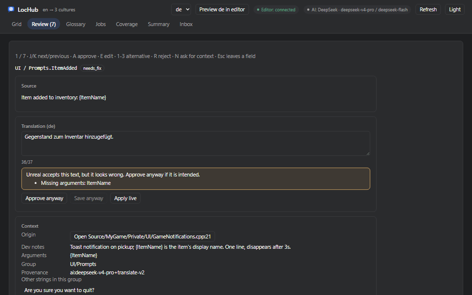

# LocHub

[English](README.md) · 简体中文

面向 Unreal Engine 5.6–5.8 的 AI 辅助本地化插件：用你自己选择的 AI 翻译项目文本——DeepSeek、Claude、GPT、Gemini、
Grok，或通过 Ollama / LM Studio 运行的本地模型（如 Qwen）——由内置检查和第二个 AI 找出问题，在编辑器内的同一个表格里审校全部
译文，再写回为标准的 Unreal 本地化数据。

**非商业用途免费**——个人项目、教育、Game Jam、免费发行且不以任何方式变现的游戏 · 其他生产用途需在
[Fab](https://www.fab.com/listings/aaf6a7ae-e02e-4975-91b4-129e2456e491) 购买许可 ·
[文档（英文）](https://app.notion.com/p/LocHub-3e7fed51161881b6be04fb732972cb38)

> **源语言就是本地化目标的 Native Culture（1.2.0 起）。** 用中文编写的项目可以直接翻译成英语、日语、韩语等：在
> **Project Settings > Plugins > LocHub > Localization Target > Setup Native Culture** 中填写 `zh-Hans`（已有目标请在
> Localization Dashboard 中修改其 Native Culture），并把 `en` 加入 **Setup Foreign Cultures**。英文项目照常使用，默认值为 `en`。

*AI 在德语译文中漏掉了 `{ItemName}`。LocHub 标记出问题，审校者补上参数，警告消失，按 <kbd>A</kbd> 通过，下一条有风险的字符串随即出现。*

## 为什么用 LocHub

- **格式错误不会进入游戏。** 格式参数（`{0}`、`{PlayerName}`）、每种目标语言的复数形式和富文本标签都会被校验两次：先由 LocHub，
  写入前再由 Unreal 自己的校验器。格式损坏的译文无法通过，手动也不行。
- **第二个 AI 审核每条译文（可选）。** 它检查含义、术语和语气，按严重程度标出问题并给出修改建议；风险最高的字符串排在审校队列最前。
- **每条字符串都带上下文翻译。** AI 会拿到字符串的来源（资产或 C++ 文件）、开发者备注和元数据、同一界面或资产中已翻译的字符串、
  项目简介与风格指南，以及你对它之前提问的回答。
- **术语表会被严格遵守。** 固定术语和不翻译词随每次请求发给译者和审核 AI，不翻译词还会在代码中再检查一次。
- **UI 长度检查。** 可能撑破界面的译文会被标出，AI 事先就会被告知长度上限（中日韩字符按 2 计）。
- **你说了算。** 人工修改永远不会被 AI 覆盖；原文变更后，相关译文标记为过期；每个任务运行前都有费用预估和硬性花费上限。
- **与人工译者协作。** 导出为 XLIFF 1.2 或 CSV，再通过同样的检查导入他们的译文。
- **输出就是普通的 `.archive` 和 `.locres`。** 随时可以停用 LocHub。

## 支持的 AI

使用你自己的 API Key：Anthropic（Claude）、OpenAI、xAI（Grok）、DeepSeek、Google Gemini；或任意兼容 OpenAI 接口的服务
（**Custom (OpenAI-compatible)**）：本地模型（Ollama、LM Studio、llama.cpp server、vLLM）、路由服务或私有部署。
本地服务器不需要 Key；使用本地模型时，文本不会离开你的电脑。设置方法见
[`Docs/05_AI_Providers_and_Keys.md`](Docs/05_AI_Providers_and_Keys.md)。

## 环境要求

- Unreal Engine 5.6、5.7 或 5.8。
- Windows（已测试）。macOS 和 Linux 的构建由同一套源码生成，但作者尚未测试。
- [Node.js](https://nodejs.org/) 22.11 或更高版本（LocHub 在 `127.0.0.1` 上运行一个本地服务）。
- 上述任一 AI 提供商的 API Key，或一个兼容 OpenAI 接口的端点（本地端点无需 Key）。

## 安装

- **从 [Fab](https://www.fab.com/listings/aaf6a7ae-e02e-4975-91b4-129e2456e491)：** 通过 Epic Games 启动器 / Fab 库安装到引擎，
  再在项目的 **Edit > Plugins**（Localization 分类）中启用。
- **从源码：** 将本仓库克隆或复制到项目的 `Plugins/LocHub`，然后同样启用。

## 快速上手

1. **Tools > LocHub > Set Up Localization Target**：按 LocHub 的要求配置项目的 `Game` 本地化目标。
2. 用 Unreal 自带的 Localization Dashboard 收集文本，然后执行 **Push (Dry Run)**，再执行 **Push**。
3. 打开 **Tools > LocHub > Open LocHub**，在 **Jobs** 页对某个语言先 **Estimate** 再 **Run**。
4. 在 **Review** 队列中审校 AI 草稿：通过、编辑后保存或驳回。
5. **Tools > LocHub > Pull**：把通过的译文写回项目的 `.archive` 并编译 `.locres`。

完整步骤见 [`Docs/04_Quick_Start.md`](Docs/04_Quick_Start.md)（英文）。

如果 LocHub 对你有帮助，在 GitHub 上点个 ⭐ 能让更多 Unreal 开发者发现它。

## 许可

LocHub 以 **Business Source License 1.1** 公开源码：可免费阅读、修改和使用，并可免费用于个人项目、教育、学术研究、Game Jam
以及免费发行且不以任何方式变现的游戏的生产环境。其他生产用途需在 Fab 购买许可。每个发布版本在发布四年后转为
**Apache License 2.0**。完整条款见 [`LICENSE`](LICENSE)；本中文说明仅供参考，以英文 README 和 LICENSE 为准。

## 支持

问题、错误报告和功能建议：**rim2812@gmail.com**。
